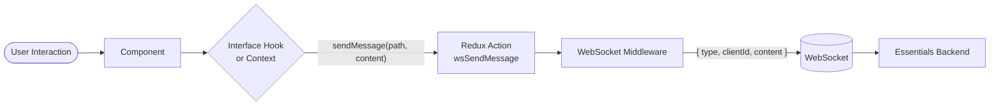

# Action Paths — App Developer Guide

**Relates to:** [Issue #90](https://github.com/PepperDash/mobile-control-react-app-core/issues/90) · [Document Mobile Control data flow #89](https://github.com/PepperDash/mobile-control-react-app-core/issues/89)

An **action path** is the WebSocket message type string sent from the React app to [PepperDash Essentials](https://github.com/PepperDash/Essentials). It identifies both the target device or room and the command to execute.

---

## Path Formats

| Target                | Format                           | Example                       |
| --------------------- | -------------------------------- | ----------------------------- |
| Device command        | `/device/{deviceKey}/{command}`  | `/device/display1/powerOn`    |
| Room command          | `/room/{roomKey}/{command}`      | `/room/techRoom/source`       |
| Device status request | `/device/{deviceKey}/fullStatus` | `/device/display1/fullStatus` |
| Room status request   | `/room/{roomKey}/status`         | `/room/techRoom/status`       |

> `deviceKey` and `roomKey` values come from the room configuration returned at connection time and stored in `runtimeConfig.roomData`.

---

## How to Send Commands

### Option 1 — Interface Hooks (preferred)

Interface hooks abstract message paths and payloads into typed function calls. Each hook corresponds to an Essentials interface implemented by the device.

```tsx
import { useIHasPowerControl } from 'mobile-control-react-app-core';

function PowerButton({ deviceKey }: { deviceKey: string }) {
  const power = useIHasPowerControl(deviceKey);

  return (
    <button onClick={power.powerOn}>Power On</button>
  );
}
```

For hooks that also return state:

```tsx
import { useILightingScenes } from 'mobile-control-react-app-core';
import type { LightingScene } from 'mobile-control-react-app-core';

function LightingPanel({ deviceKey }: { deviceKey: string }) {
  const lighting = useILightingScenes(deviceKey);

  if (!lighting) return null; // device state not yet in store

  return (
    <>
      {lighting.lightingState.scenes.map((scene: LightingScene) => (
        <button key={scene.name} onClick={() => lighting.selectScene(scene)}>
          {scene.name}
        </button>
      ))}
    </>
  );
}
```

> See [interface-hooks-app-dev.md](./interface-hooks-app-dev.md) for the full hook catalog.

---

### Option 2 — Direct Context (advanced)

For commands not covered by an existing interface hook, call `useWebsocketContext()` directly.

```tsx
import { useWebsocketContext } from 'mobile-control-react-app-core';

function CustomControl({ deviceKey }: { deviceKey: string }) {
  const { sendMessage, sendSimpleMessage } = useWebsocketContext();

  // Arbitrary object payload
  const sendRoute = () =>
    sendMessage(`/device/${deviceKey}/route`, {
      inputKey: 'hdmi1',
      outputKey: 'display1',
      routeType: 'AudioVideo',
    });

  // Simple scalar payload — wrapped automatically as { value }
  const setLevel = () =>
    sendSimpleMessage(`/device/${deviceKey}/level`, 75);

  return <button onClick={sendRoute}>Route</button>;
}
```

#### Context API Reference

| Function             | Signature                                                    | Payload sent    |
| -------------------- | ------------------------------------------------------------ | --------------- |
| `sendMessage`        | `(type: string, content: unknown) => void`                   | `content` as-is |
| `sendSimpleMessage`  | `(type: string, value: boolean \| number \| string) => void` | `{ value }`     |
| `addEventHandler`    | `(eventType, key, callback) => void`                         | —               |
| `removeEventHandler` | `(eventType, key) => void`                                   | —               |
| `reconnect`          | `() => void`                                                 | —               |

---

## Subscribing to Events

The `/event/` message prefix is used for one-off server-pushed events that are not persistent state (e.g., shutdown timer ticks, user code changes).

```tsx
import { useEffect } from 'react';
import { useWebsocketContext } from 'mobile-control-react-app-core';

function ShutdownTimer() {
  const { addEventHandler, removeEventHandler } = useWebsocketContext();

  useEffect(() => {
    addEventHandler('/event/shutdownTimer', 'myComponent', (msg) => {
      console.log('Shutdown timer event', msg.content);
    });
    return () => removeEventHandler('/event/shutdownTimer', 'myComponent');
  }, [addEventHandler, removeEventHandler]);

  return null;
}
```

- The `key` string (second argument) must be unique per subscriber — use the component name or a stable ID.
- Clean up handlers on unmount to avoid stale callbacks.

---

## Flow



---

## Notes

- `MobileControlProvider` must wrap your component tree — it sets up the Redux store and `WebsocketContext`.
- Commands are dropped silently when `websocket.isConnected` is `false` — the middleware logs a warning.
- The `clientId` is injected by the middleware automatically from `runtimeConfig.roomData.clientId`; you never need to set it manually.
