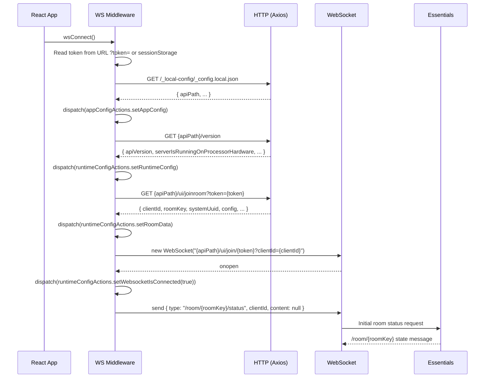
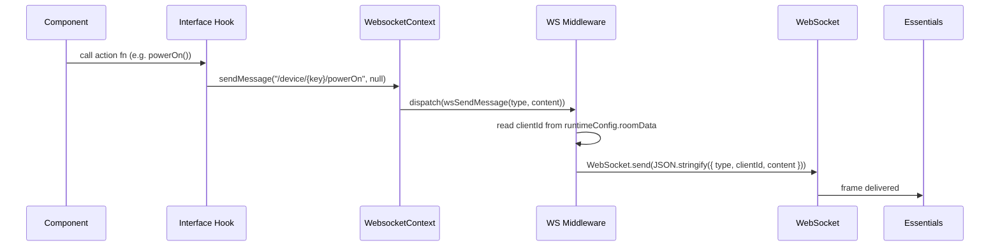

# Action Paths — Contributor Reference

**Relates to:** [Issue #90](https://github.com/PepperDash/mobile-control-react-app-core/issues/90) · [Document Mobile Control data flow #89](https://github.com/PepperDash/mobile-control-react-app-core/issues/89)

Internal architecture for how messages travel from React components to [PepperDash Essentials](https://github.com/PepperDash/Essentials) over WebSocket.

**Key source:** `src/lib/store/middleware/websocketMiddleware.ts`

---

## Wire Format

Every outbound WebSocket frame is a JSON-serialized object:

```json
{
  "type": "/device/{deviceKey}/{command}",
  "clientId": "abc123",
  "content": { ... }
}
```

- `type` — the action path (message routing key)
- `clientId` — injected by middleware from `runtimeConfig.roomData.clientId`
- `content` — arbitrary payload; `null` for command-only messages

---

## Redux Middleware Action Types

Defined in `websocketMiddleware.ts` and re-exported from `src/lib/store/index.ts`:

| Constant                  | Creator                                 | Purpose                                    |
| ------------------------- | --------------------------------------- | ------------------------------------------ |
| `WS_CONNECT`              | `wsConnect()`                           | Initiate connection sequence               |
| `WS_DISCONNECT`           | `wsDisconnect()`                        | Close socket with code 4100                |
| `WS_SEND_MESSAGE`         | `wsSendMessage(type, content)`          | Send a message over the open socket        |
| `WS_ADD_EVENT_HANDLER`    | `wsAddEventHandler(eventType, key, cb)` | Register a `/event/` listener              |
| `WS_REMOVE_EVENT_HANDLER` | `wsRemoveEventHandler(eventType, key)`  | Remove a `/event/` listener                |
| `WS_RECONNECT`            | `wsReconnect()`                         | Navigate to gateway URL to re-authenticate |

---

## Connection Initialization Sequence

Triggered by `wsConnect()`, dispatched on `WebsocketProvider` mount.



---

## Outbound Message Flow



---

## sendMessage Implementation

```typescript
// WebsocketProvider.tsx — dispatches the Redux action
const sendMessage = (type: string, content: SimpleContent | unknown) => {
  dispatch(wsSendMessage(type, content));
};

// websocketMiddleware.ts — middleware handles WS_SEND_MESSAGE
const sendMessage = (messageType, content, getState) => {
  const { isConnected } = getState().runtimeConfig.websocket;
  const { clientId } = getState().runtimeConfig.roomData;

  if (state.client && isConnected) {
    state.client.send(JSON.stringify({ type: messageType, clientId, content }));
  } else {
    console.warn('WebSocket middleware: Cannot send message - not connected');
  }
};
```

---

## WebSocket Close Codes

| Code   | Trigger                            | Auto-Reconnect | Behavior                                                                                      |
| ------ | ---------------------------------- | -------------- | --------------------------------------------------------------------------------------------- |
| `1000` | Normal close                       | Yes            | Standard server close; starts reconnection loop                                               |
| `4000` | User code changed                  | No             | Clears state; shows user-code entry UI                                                        |
| `4001` | Processor disconnect / room change | Conditional    | Reconnects if `touchpanelKey` present or running on processor hardware; otherwise shows error |
| `4002` | Room combination changed           | No             | Clears state; shows reconnect prompt                                                          |
| `4100` | Client-initiated close             | No             | `wsDisconnect()` was called; no reconnection                                                  |

---

## Reconnection Loop

- On disconnect (non-4100, non-4000, non-4002): `startReconnectionLoop(dispatch)` schedules a `wsConnect()` after **5000 ms**
- The loop runs until a successful `onopen` event, at which point `stopReconnectionLoop()` cancels the timer
- `wsReconnect()` (manual reconnect button) navigates to the gateway URL to re-authenticate using `systemUuid`, `roomKey`, and optional `userCode`

---

## State Cleared on Disconnect

When the socket closes (except code 4100), the middleware dispatches:

- `uiActions.setShowReconnect(true)`
- `runtimeConfigActions.setWebsocketIsConnected(false)`
- `devicesActions.clearDevices()`
- `roomsActions.clearRooms()`
- `uiActions.clearAllModals()`
- `uiActions.clearSyncState()`

---

## Adding a New Outbound Message Type

No middleware changes are needed for new message paths. The path string is passed directly through `wsSendMessage`. To add a new action:

1. Create an interface hook in `src/lib/shared/hooks/interfaces/useI{InterfaceName}.ts`
2. Call `sendMessage(`/device/${key}/{command}`, payload)` inside the hook
3. Export from `src/lib/shared/hooks/interfaces/index.ts`

See [interface-hooks-contributors.md](./interface-hooks-contributors.md) for the full authoring guide.
