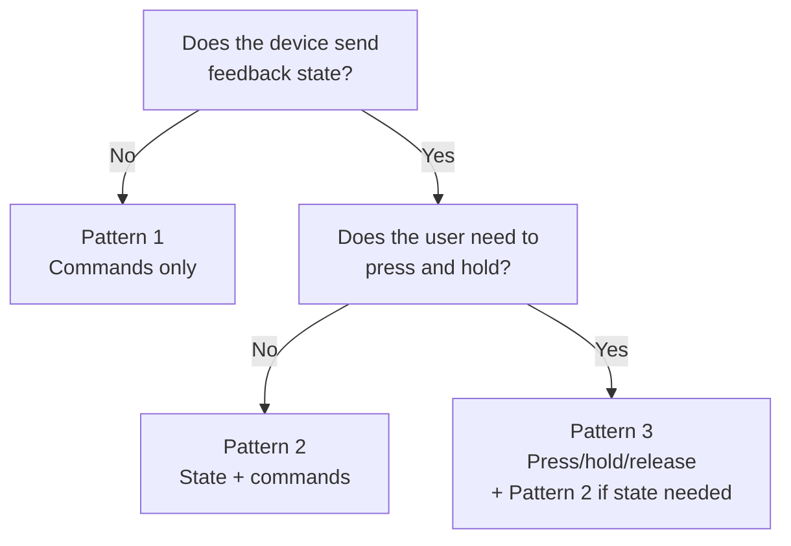

# HOW TO: Writing Your Own Custom Interface Hook

**Relates to:** [Issue #95](https://github.com/PepperDash/mobile-control-react-app-core/issues/95) · [Document Mobile Control data flow #89](https://github.com/PepperDash/mobile-control-react-app-core/issues/89)

The library ships built-in hooks for the most common Essentials interfaces. When your Crestron system exposes a device capability that no built-in hook covers, you can write your own hook inside your app using the same building blocks the library uses internally.

---

## When to Write a Custom Hook

- A device in your system implements an Essentials interface that the library has no hook for yet.
- You need to combine multiple commands or state properties into a single typed API for your components.
- You want to co-locate device command logic and keep components free of path string details.

> If you believe the interface is broadly useful, consider also submitting it to the library. See [interface-hooks-contributors.md](./interface-hooks-contributors.md).

---

## Building Blocks

All custom hooks are built from these imports:

```tsx
import {
  useWebsocketContext,   // send commands over WebSocket
  useGetDevice,          // read device state from the Redux store
  useButtonHeldHeartbeat, // press / held / release for repeating buttons
} from 'mobile-control-react-app-core';
```

| Tool                                    | Purpose                                                            |
| --------------------------------------- | ------------------------------------------------------------------ |
| `useWebsocketContext()`                 | Returns `sendMessage` and `sendSimpleMessage` for sending commands |
| `useGetDevice<T>(key)`                  | Returns typed device state, or `undefined` until first message     |
| `useButtonHeldHeartbeat(path, command)` | Sends `pressed` → `held` (repeating) → `released` for held buttons |

---

## Pattern 1 — Commands Only (No Feedback)

Use this when the Essentials interface only has commands with no corresponding feedback state.

```tsx
// hooks/useMyProjectorControl.ts
import { useWebsocketContext } from 'mobile-control-react-app-core';

export interface MyProjectorControlReturn {
  freeze: () => void;
  unfreeze: () => void;
  blankOn: () => void;
  blankOff: () => void;
}

export function useMyProjectorControl(deviceKey: string): MyProjectorControlReturn {
  const { sendMessage } = useWebsocketContext();

  return {
    freeze:   () => sendMessage(`/device/${deviceKey}/freeze`, null),
    unfreeze: () => sendMessage(`/device/${deviceKey}/unfreeze`, null),
    blankOn:  () => sendMessage(`/device/${deviceKey}/blankOn`, null),
    blankOff: () => sendMessage(`/device/${deviceKey}/blankOff`, null),
  };
}
```

**Usage:**

```tsx
function ProjectorControls({ deviceKey }: { deviceKey: string }) {
  const projector = useMyProjectorControl(deviceKey);

  return (
    <>
      <button onClick={projector.freeze}>Freeze</button>
      <button onClick={projector.blankOn}>Blank</button>
    </>
  );
}
```

> Commands-only hooks never return `undefined` — the actions are always available regardless of whether device state has arrived.

---

## Pattern 2 — State + Commands (With Feedback)

Use this when the device also sends state back that your UI needs to display.

### Step 1 — Define your state interface

Declare a TypeScript interface matching the JSON shape Essentials sends for this device. Property names must match the keys in the WebSocket message payload exactly.

```tsx
// types/MyShadeState.ts
export interface MyShadeState {
  isOpen: boolean;
  isClosed: boolean;
  isMoving: boolean;
  currentPosition: number; // 0–100
}
```

### Step 2 — Write the hook

```tsx
// hooks/useMyShades.ts
import { useGetDevice, useWebsocketContext } from 'mobile-control-react-app-core';
import { MyShadeState } from '../types/MyShadeState';

export interface MyShadesReturn {
  state: MyShadeState;
  open: () => void;
  close: () => void;
  stop: () => void;
  setPosition: (position: number) => void;
}

export function useMyShades(deviceKey: string): MyShadesReturn | undefined {
  const { sendMessage, sendSimpleMessage } = useWebsocketContext();
  const state = useGetDevice<MyShadeState>(deviceKey);

  if (!state) return undefined; // device state not yet in store

  return {
    state,
    open:        () => sendMessage(`/device/${deviceKey}/open`, null),
    close:       () => sendMessage(`/device/${deviceKey}/close`, null),
    stop:        () => sendMessage(`/device/${deviceKey}/stop`, null),
    setPosition: (position) => sendSimpleMessage(`/device/${deviceKey}/setPosition`, position),
  };
}
```

### Step 3 — Use in a component

```tsx
function ShadePanel({ deviceKey }: { deviceKey: string }) {
  const shades = useMyShades(deviceKey);

  if (!shades) return <span>Loading…</span>;

  return (
    <>
      <span>Position: {shades.state.currentPosition}%</span>
      <button onClick={shades.open}>Open</button>
      <button onClick={shades.close}>Close</button>
      <button onClick={shades.stop} disabled={!shades.state.isMoving}>Stop</button>
    </>
  );
}
```

> Return `undefined` (not an empty object) when state hasn't arrived. Components handle this with a loading guard, which prevents rendering stale or incorrect UI.

---

## Pattern 3 — Press / Hold / Release (Repeating Buttons)

Some Essentials commands expect three events: `pressed`, `held` (repeated while held), and `released`. Use `useButtonHeldHeartbeat` — it handles the timing and repetition automatically.

```tsx
// hooks/useMyDVDControl.ts
import { useButtonHeldHeartbeat } from 'mobile-control-react-app-core';
import type { PressHoldReleaseReturn } from 'mobile-control-react-app-core';

export interface MyDVDControlReturn {
  skipForward: PressHoldReleaseReturn;
  skipBack: PressHoldReleaseReturn;
  fastForward: PressHoldReleaseReturn;
  rewind: PressHoldReleaseReturn;
}

export function useMyDVDControl(deviceKey: string): MyDVDControlReturn {
  const path = `/device/${deviceKey}`;

  return {
    skipForward: useButtonHeldHeartbeat(path, 'skipForward'),
    skipBack:    useButtonHeldHeartbeat(path, 'skipBack'),
    fastForward: useButtonHeldHeartbeat(path, 'ffwd'),
    rewind:      useButtonHeldHeartbeat(path, 'rew'),
  };
}
```

Attach the returned object directly to a button using spread:

```tsx
function DVDControls({ deviceKey }: { deviceKey: string }) {
  const dvd = useMyDVDControl(deviceKey);

  return (
    <>
      {/* spread attaches onPointerDown / onPointerUp automatically */}
      <button {...dvd.rewind}>⏪</button>
      <button {...dvd.fastForward}>⏩</button>
      <button {...dvd.skipBack}>⏮</button>
      <button {...dvd.skipForward}>⏭</button>
    </>
  );
}
```

> `useButtonHeldHeartbeat` sends `pressed` on pointer down, then `held` every 250 ms while the pointer is held, and `released` on pointer up. This matches the behavior Essentials expects for ramp-able commands like volume or transport.

---

## Sending Different Payload Types

`useWebsocketContext` provides two send functions:

| Function                         | When to use             | Payload format sent                            |
| -------------------------------- | ----------------------- | ---------------------------------------------- |
| `sendMessage(path, null)`        | Simple command, no data | `{ type: path, clientId, content: null }`      |
| `sendMessage(path, object)`      | Structured data payload | `{ type: path, clientId, content: object }`    |
| `sendSimpleMessage(path, value)` | Single scalar value     | `{ type: path, clientId, content: { value } }` |

```tsx
const { sendMessage, sendSimpleMessage } = useWebsocketContext();

// Command with no data
sendMessage(`/device/${key}/powerOn`, null);

// Scalar value (number, boolean, or string)
sendSimpleMessage(`/device/${key}/level`, 75);

// Structured object
sendMessage(`/device/${key}/route`, { inputKey: 'hdmi1', outputKey: 'display1' });
```

---

## Checking Interface Support at Runtime

If a device key might or might not implement a given interface depending on the Essentials configuration, check before rendering controls:

```tsx
import { useDeviceSupportsInterface } from 'mobile-control-react-app-core';

function ConditionalShadePanel({ deviceKey }: { deviceKey: string }) {
  const supportsShades = useDeviceSupportsInterface(deviceKey, 'IShades');

  if (!supportsShades) return null;

  return <ShadePanel deviceKey={deviceKey} />;
}
```

> Interface names come from the Essentials plugin. Use the C# interface name exactly (e.g., `"IHasPowerControl"`, `"IMatrixRouting"`).

---

## Summary: Which Pattern to Use


