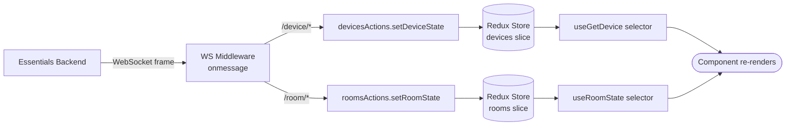

# Device State & Feedback — App Developer Guide

**Relates to:** [Issue #91](https://github.com/PepperDash/mobile-control-react-app-core/issues/91) · [Document Mobile Control data flow #89](https://github.com/PepperDash/mobile-control-react-app-core/issues/89)

Device state and room state are pushed from [Essentials](https://github.com/PepperDash/Essentials) over WebSocket and stored in a Redux store. Components read state via selector hooks — when state updates, components re-render automatically.

---

## Redux Store Shape

```
store
├── appConfig       — static app config loaded from _config.local.json
├── runtimeConfig   — connection state, roomData, clientId, roomKey
├── rooms           — Record<roomKey, RoomState>
├── devices         — Record<deviceKey, DeviceState>
└── ui              — modal visibility, error messages, sync state
```

---

## Reading Device State

### `useGetDevice<T>(deviceKey)`

Returns the full state object for a device, or `undefined` if not yet received.

```tsx
import { useGetDevice } from 'mobile-control-react-app-core';
import type { DisplayState } from 'mobile-control-react-app-core';

function DisplayStatus({ deviceKey }: { deviceKey: string }) {
  const display = useGetDevice<DisplayState>(deviceKey);

  if (!display) return <span>Loading...</span>;

  return <span>Power: {display.powerState ? 'On' : 'Off'}</span>;
}
```

- Pass the TypeScript interface as a generic (`<DisplayState>`) to get typed access.
- Returns `undefined` until the first state message for that device key arrives.

### `useGetAllDevices()`

Returns `Record<string, DeviceState>` — the full devices slice.

---

## Reading Room State

### `useRoomState<T>(roomKey)` / `useGetRoom<T>(roomKey)`

These are aliases. Returns the full room state or `undefined`.

```tsx
import { useRoomState } from 'mobile-control-react-app-core';

function RoomPower({ roomKey }: { roomKey: string }) {
  const room = useRoomState(roomKey);
  return <span>{room?.isOn ? 'Room On' : 'Room Off'}</span>;
}
```

### Room Selector Hooks

| Hook                                   | Returns                                             |
| -------------------------------------- | --------------------------------------------------- |
| `useRoomState(roomKey)`                | Full room state                                     |
| `useRoomConfiguration(roomKey)`        | Static room config (devices, sources, destinations) |
| `useRoomVolume(roomKey, volumeKey)`    | `Volume` object for a named zone                    |
| `useRoomLevelControls(roomKey)`        | `LevelControlsState` for the room                   |
| `useRoomName(roomKey)`                 | Room display name string                            |
| `useRoomIsOn(roomKey)`                 | `boolean`                                           |
| `useRoomInCall(roomKey)`               | `boolean`                                           |
| `useRoomIsWarmingUp(roomKey)`          | `boolean`                                           |
| `useRoomIsCoolingDown(roomKey)`        | `boolean`                                           |
| `useRoomSourceList(roomKey)`           | Array of available sources                          |
| `useRoomDestinations(roomKey)`         | Destination map                                     |
| `useRoomDestinationList(roomKey)`      | Array of destinations                               |
| `useRoomEnvironmentalDevices(roomKey)` | Environmental device keys                           |
| `useRoomShareState(roomKey)`           | Sharing/presentation state                          |

---

## Reading Connection State

```tsx
import { useRuntimeConfig } from 'mobile-control-react-app-core';

// Individual selectors from runtimeConfig hooks
const roomKey = useCurrentRoomKey();
const isConnected = useWsIsConnected();
const roomData = useRoomData();      // clientId, config, deviceInterfaceSupport
```

---

## Requesting State on Mount

By default, the middleware requests room status (`/room/{key}/status`) immediately after connection. For individual device state, use `useGetAllDeviceStateFromRoomConfiguration`:

```tsx
import {
  useRoomConfiguration,
  useGetAllDeviceStateFromRoomConfiguration,
} from 'mobile-control-react-app-core';

function RoomPanel({ roomKey }: { roomKey: string }) {
  const config = useRoomConfiguration(roomKey);

  // Sends /device/{key}/fullStatus for every device key in the room config
  useGetAllDeviceStateFromRoomConfiguration({ config });

  return <div>...</div>;
}
```

- Sends `fullStatus` requests once per mount (guarded by a `useRef`).
- Pass `requestStatus={false}` to suppress the requests when you only need to observe state.

---

## Subscribing to Events

For transient events that are not stored in state (e.g., shutdown timer ticks):

```tsx
import { useEffect } from 'react';
import { useWebsocketContext } from 'mobile-control-react-app-core';

function ShutdownTimer({ roomKey }: { roomKey: string }) {
  const { addEventHandler, removeEventHandler } = useWebsocketContext();

  useEffect(() => {
    addEventHandler(`/event/shutdownTimer`, 'ShutdownTimer', (msg) => {
      console.log('Timer event', msg.content);
    });
    return () => removeEventHandler(`/event/shutdownTimer`, 'ShutdownTimer');
  }, [addEventHandler, removeEventHandler]);
}
```

---

## State Update Flow



---

## Notes

- **State merges incrementally.** Essentials sends partial state updates; they are deep-merged with existing state. Arrays are replaced entirely.
- **Keys are case-sensitive.** `deviceKey` and `roomKey` strings must match exactly what Essentials sends.
- **Interface hooks handle state access internally.** Hooks like `useILightingScenes` and `useIBasicVolumeWithFeedback` call `useGetDevice` themselves — you typically do not need to call the selector separately when using a hook.
