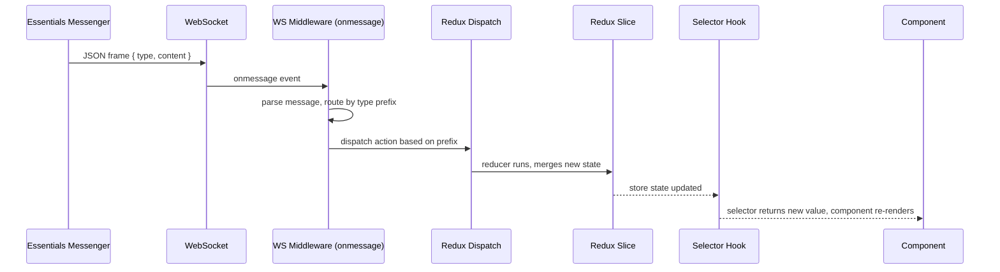

# Device State & Feedback — Contributor Reference

**Relates to:** [Issue #91](https://github.com/PepperDash/mobile-control-react-app-core/issues/91) · [Document Mobile Control data flow #89](https://github.com/PepperDash/mobile-control-react-app-core/issues/89)

Internal architecture for how state messages from [Essentials](https://github.com/PepperDash/Essentials) Messengers flow into the Redux store and surface in React components.

**Key sources:**
- `src/lib/store/middleware/websocketMiddleware.ts`
- `src/lib/store/devices/devices.slice.ts`
- `src/lib/store/rooms/rooms.slice.ts`
- `src/lib/store/runtimeConfig/runtimeConfig.slice.ts`

---

## End-to-End Feedback Flow



---

## Message Routing

The middleware routes every incoming frame based on the `type` field prefix:

```typescript
// websocketMiddleware.ts — onmessage handler
if (message.type === 'close') {
  newWs.close(4001, message.content as string);
} else if (message.type.startsWith('/system/')) {
  // handled by switch statement (see System Messages below)
} else if (message.type.startsWith('/event/')) {
  // dispatched to registered event handler callbacks
} else if (message.type.startsWith('/room/')) {
  dispatch(roomsActions.setRoomState(message));
} else if (message.type.startsWith('/device/')) {
  dispatch(devicesActions.setDeviceState(message));
}
```

---

## System Messages

System messages update `runtimeConfig` slice or trigger side effects:

| `message.type`                   | `message.content` type                                      | Effect                                                      |
| -------------------------------- | ----------------------------------------------------------- | ----------------------------------------------------------- |
| `/system/touchpanelKey`          | `string`                                                    | `runtimeConfigActions.setTouchpanelKey`                     |
| `/system/roomKey`                | `string`                                                    | Clears rooms + devices; `setCurrentRoomKey`                 |
| `/system/userCodeChanged`        | `{ userCode, qrUrl }`                                       | `runtimeConfigActions.setUserCode`                          |
| `/system/roomCombinationChanged` | `string`                                                    | `window.location.reload()`                                  |
| `/system/deviceInterfaces`       | `{ deviceInterfaces: Record<string, DeviceInterfaceInfo> }` | Merges into `runtimeConfig.roomData.deviceInterfaceSupport` |

---

## Device State Reducer (`setDeviceState`)

**Source:** `src/lib/store/devices/devices.slice.ts`

```typescript
setDeviceState(state, action: PayloadAction<Message>) {
  // Extract key from message type: "/device/{key}" → key
  const key = action.payload.type.slice(action.payload.type.lastIndexOf('/') + 1);
  const content = action.payload.content as DeviceState;

  // Deep merge: new content overlays existing state
  // Arrays in new content replace (not merge) the existing array
  const newState = _.mergeWith({}, state[key], content, (_objValue, srcValue) => {
    if (Array.isArray(srcValue)) return srcValue.slice();
    return undefined; // let mergeWith handle objects recursively
  });

  state[key] = newState;
}
```

**Key behaviors:**
- Keyed by the last segment of `message.type` (e.g., `/device/display1` → `display1`)
- Deep merge: Essentials can send partial updates — only changed properties need to be sent
- **Arrays replace entirely** — no array element merging
- `clearDevices()` resets the entire devices slice to `{}` (called on disconnect and room key change)

---

## Room State Reducer (`setRoomState`)

**Source:** `src/lib/store/rooms/rooms.slice.ts`

Identical merge strategy to `setDeviceState`. Key extracted from the last segment of `message.type`.

**Additional behavior:** `setRoomState` is also called for `fullStatus` responses from the room.

---

## runtimeConfig Slice

Tracks connection lifecycle and session data:

```typescript
interface RuntimeConfigState {
  apiVersion: string;
  serverIsRunningOnProcessorHardware: boolean | undefined;
  websocket: { isConnected?: boolean };
  pluginVersion: string;
  disconnectionMessage: string;
  token: string;
  currentRoomKey: string;
  touchpanelKey: string;
  roomData: {
    clientId: string;
    roomKey: string;
    systemUuid: string;
    roomUuid: string;
    userAppUrl: string;
    userCode: string;
    qrUrl: string;
    config: {
      runtimeInfo: { pluginVersion, essentialsVersion, pepperDashCoreVersion, essentialsPlugins };
      rooms: string[];
      devices: string[];
    };
    deviceInterfaceSupport: Record<string, DeviceInterfaceInfo>;
  };
}
```

| Reducer                          | Trigger                             |
| -------------------------------- | ----------------------------------- |
| `setRuntimeConfig`               | HTTP GET `/version` response        |
| `setRoomData`                    | HTTP GET `/ui/joinroom` response    |
| `setWebsocketIsConnected(bool)`  | `onopen` (true) / `onclose` (false) |
| `setCurrentRoomKey(key)`         | `/system/roomKey` message           |
| `setTouchpanelKey(key)`          | `/system/touchpanelKey` message     |
| `setDeviceInterfaces(map)`       | `/system/deviceInterfaces` message  |
| `setUserCode({userCode, qrUrl})` | `/system/userCodeChanged` message   |

---

## State Request Pattern

Components request device state on mount by sending `fullStatus` messages:

```typescript
// useGetAllDeviceStateFromRoomConfiguration.ts
deviceKeysSet.forEach((dk) => {
  sendMessage(`/device/${dk}/fullStatus`, { deviceKey: dk });
});
```

- The middleware sends `/room/{roomKey}/status` automatically after WebSocket connects.
- Individual device state must be explicitly requested via `/device/{key}/fullStatus`.
- Essentials responds by pushing a `/device/{key}` message with the full state object.

---

## Event Handler System

Event handlers are stored in middleware state (not Redux state) because callbacks are not serializable:

```typescript
// Middleware state (local, not in Redux)
state.eventHandlers: Record<string, Record<string, (data: Message) => void>>
//                          eventType        key        callback
```

- `wsAddEventHandler(eventType, key, callback)` — adds a callback to the in-memory map
- `wsRemoveEventHandler(eventType, key)` — removes by eventType + key
- On message received with `/event/` prefix: all registered callbacks for that `eventType` are invoked

> Note: `wsAddEventHandler` is excluded from Redux's serializable check middleware because callbacks are non-serializable.

---

## Adding Support for a New State Shape

1. Create a TypeScript interface in `src/lib/types/state/state/` (e.g., `MyDeviceState.ts`)
2. Export from `src/lib/types/state/state/index.ts` and `src/lib/types/index.ts`
3. Essentials sends the state under `/device/{key}` — no middleware changes needed
4. Components use `useGetDevice<MyDeviceState>(key)` to access the typed state
5. Create an interface hook in `src/lib/shared/hooks/interfaces/` if actions are needed

See [interface-hooks-contributors.md](./interface-hooks-contributors.md) for the hook authoring guide.
