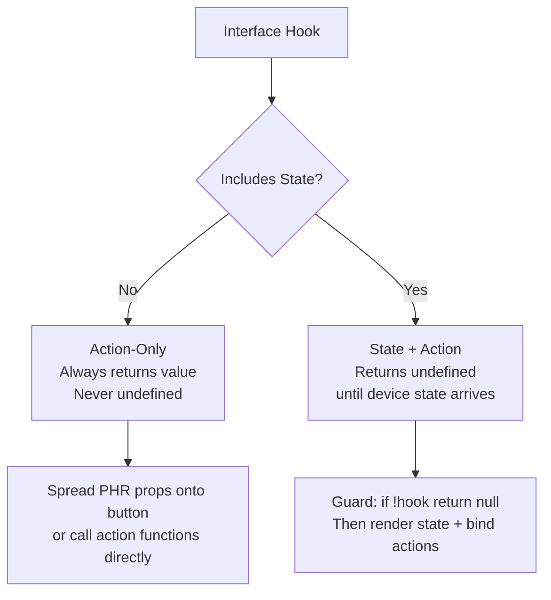

# Interface Hooks — App Developer Guide

**Relates to:** [Issue #94](https://github.com/PepperDash/mobile-control-react-app-core/issues/94) · [Document Mobile Control data flow #89](https://github.com/PepperDash/mobile-control-react-app-core/issues/89)

Interface hooks are the primary API for interacting with Essentials devices from React components. Each hook corresponds to a C# interface implemented by a device in [Essentials](https://github.com/PepperDash/Essentials).

---

## What Interface Hooks Provide

- **Actions** — typed functions that send WebSocket commands to Essentials
- **State** (on hooks that include feedback) — the current device state from the Redux store, reactively updated

---

## Two Hook Categories

### Action-Only Hooks

No Redux state. Return only action functions. All physical button interactions (press/hold/release) return a `PressHoldReleaseReturn` object.

```tsx
import { useIHasPowerControl } from 'mobile-control-react-app-core';

function PowerButtons({ deviceKey }: { deviceKey: string }) {
  const power = useIHasPowerControl(deviceKey);

  return (
    <>
      <button onClick={power.powerOn}>On</button>
      <button onClick={power.powerOff}>Off</button>
    </>
  );
}
```

### State + Action Hooks

Include current device state alongside actions. Return `undefined` until state arrives from Essentials — always guard for `undefined`.

```tsx
import { useILightingScenes } from 'mobile-control-react-app-core';

function LightingPanel({ deviceKey }: { deviceKey: string }) {
  const lighting = useILightingScenes(deviceKey);

  if (!lighting) return null;

  return (
    <ul>
      {lighting.lightingState.scenes.map(scene => (
        <li key={scene.name}>
          <button onClick={() => lighting.selectScene(scene)}>{scene.name}</button>
        </li>
      ))}
    </ul>
  );
}
```

---

## Press / Hold / Release Buttons

Hooks using `useButtonHeldHeartbeat` return `PressHoldReleaseReturn`, which provides pointer event handlers for simulating physical button behavior. Spread them onto a button element:

```tsx
import { useITransport } from 'mobile-control-react-app-core';

function TransportBar({ deviceKey }: { deviceKey: string }) {
  const transport = useITransport(deviceKey);

  return (
    <button {...transport.play}>Play</button>
  );
}
```

`PressHoldReleaseReturn` shape:
```typescript
{
  onPointerDown: (e: React.PointerEvent) => void;
  onPointerUp:   (e: React.PointerEvent) => void;
  onPointerLeave:(e: React.PointerEvent) => void;
}
```

- **Press:** sends `{ value: 'pressed' }` immediately
- **Held:** sends `{ value: 'held' }` every 250 ms while pointer is down
- **Release:** sends `{ value: 'released' }` on pointer up or leave

---

## Hook Catalog

### Volume

| Hook                                                  | Key Type               | Returns                                       | Actions                                                                                         |
| ----------------------------------------------------- | ---------------------- | --------------------------------------------- | ----------------------------------------------------------------------------------------------- |
| `useIBasicVolume(path)`                               | path string            | `IBasicVolumeReturn`                          | `volumeUp`, `volumeDown` (PHR), `muteToggle`                                                    |
| `useIBasicVolumeWithFeedback(path, volumeState)`      | path + Volume          | `IBasicVolumeWithFeedbackReturn \| undefined` | + `setLevel(number)`, `muteOn`, `muteOff`; includes `volumeState`                               |
| `useILevelControls(key)`                              | device or room key     | `ILevelControlsReturn \| undefined`           | `setLevel(levelKey, value)`, `muteToggle(levelKey)`, `muteOn`, `muteOff`; includes `levelState` |
| `useDeviceIBasicVolume(deviceKey)`                    | device key             | `IBasicVolumeReturn \| undefined`             | Convenience wrapper — builds path as `/device/{key}`                                            |
| `useDeviceIBasicVolumeWithFeedback(deviceKey)`        | device key             | `IBasicVolumeWithFeedbackReturn \| undefined` | Convenience wrapper — builds path + reads device volume state                                   |
| `useRoomIBasicVolume(roomKey)`                        | room key               | `IBasicVolumeReturn \| undefined`             | Convenience wrapper — builds path as `/room/{key}`                                              |
| `useRoomIBasicVolumeWithFeedback(roomKey, volumeKey)` | room + volume zone key | `IBasicVolumeWithFeedbackReturn \| undefined` | Convenience wrapper — reads room volume state by zone                                           |

> `useIBasicVolume` and `useIBasicVolumeWithFeedback` accept a full path prefix, e.g., `/device/{key}` or `/room/{key}`. The convenience wrappers build that path for you.

---

### Transport / Media Playback

| Hook                         | Key Type   | Returns                   | Actions                                                                                        |
| ---------------------------- | ---------- | ------------------------- | ---------------------------------------------------------------------------------------------- |
| `useITransport(key)`         | device key | `ITransportProps`         | `play`, `pause`, `stop`, `prevTrack`, `nextTrack`, `rewind`, `fastForward`, `record` (all PHR) |
| `useIChannel(key)`           | device key | `IChannelMessengerProps`  | `channelUp`, `channelDown`, `lastChannel`, `guide`, `info`, `exit` (all PHR)                   |
| `useIDvr(key)`               | device key | `IDvrProps`               | `dvrList`, `record` (both PHR)                                                                 |
| `useINumeric(key)`           | device key | `INumericProps`           | `digit0`–`digit9`, `keypadAccessoryButton1`, `keypadAccessoryButton2` (all PHR)                |
| `useISetTopBoxControls(key)` | device key | `ISetTopBoxControlsProps` | `dvrList`, `replay` (both PHR)                                                                 |

---

### Power & Display

| Hook                                  | Key Type   | Returns                                          | Actions                                                                                                                       |
| ------------------------------------- | ---------- | ------------------------------------------------ | ----------------------------------------------------------------------------------------------------------------------------- |
| `useIHasPowerControl(key)`            | device key | `IHasPowerWithFeedbackProps`                     | `powerOn`, `powerOff`, `powerToggle`                                                                                          |
| `useTwoWayDisplayBase(key)`           | device key | `TwoWayDisplayBaseReturn \| undefined`           | Composite: `powerControl` (useIHasPowerControl) + `inputControl` (useIHasSelectableItems); includes `displayState`, `powerFb` |
| `useISwitchedOutput(key)`             | device key | `ISwitchedOutputReturn \| undefined`             | `on`, `off`; includes `switchedOutputState`                                                                                   |
| `useIProjectorScreenLiftControl(key)` | device key | `IProjectorScreenLiftControlReturn \| undefined` | `raise`, `lower`; includes `projectorScreenLiftControlState`                                                                  |

---

### Routing & Switching

| Hook                                  | Key Type   | Returns                                     | Actions                                                                       |
| ------------------------------------- | ---------- | ------------------------------------------- | ----------------------------------------------------------------------------- |
| `useIRunRouteAction(roomKey)`         | room key   | `IRunRouteActionProps \| undefined`         | `runRoute({ sourceListItemKey, sourceListKey? })`; includes `routingState`    |
| `useIRunDirectRouteAction(roomKey)`   | room key   | `IRunDirectRouteActionProps`                | `runDirectRoute({ sourceKey, destinationKey, signalType })`                   |
| `useIRunDefaultPresentRoute(roomKey)` | room key   | `IRunDefaultPresentRouteProps`              | `runDefaultPresentRoute()`                                                    |
| `useIMatrixRouting(key)`              | device key | `IMatrixRoutingReturn \| undefined`         | `setRoute({ inputKey, outputKey, routeType })`; includes `matrixRoutingState` |
| `useIHasSelectableItems<T>(key)`      | device key | `IHasSelectableItemsReturn<T> \| undefined` | `selectItem(itemKey)`; includes `itemsState`                                  |

---

### Cameras

| Hook                  | Key Type   | Returns                          | Actions                                                                                                |
| --------------------- | ---------- | -------------------------------- | ------------------------------------------------------------------------------------------------------ |
| `useCameraBase(key)`  | device key | `CameraBaseProps \| undefined`   | `up`, `down`, `left`, `right`, `zoomIn`, `zoomOut` (all PHR), `recallPreset(number)`; includes `state` |
| `useIHasCameras(key)` | device key | `IHasCamerasReturn \| undefined` | `selectCamera(cameraKey)`; includes `state`                                                            |

---

### Lighting & Environment

| Hook                           | Key Type   | Returns                                  | Actions                                                                             |
| ------------------------------ | ---------- | ---------------------------------------- | ----------------------------------------------------------------------------------- |
| `useILightingScenes(key)`      | device key | `ILightingScenesReturn \| undefined`     | `selectScene(scene: LightingScene)`; includes `lightingState`                       |
| `useIShadesOpenCloseStop(key)` | device key | `IShadesOpenCloseStopProps \| undefined` | `shadeUp`, `shadeDown`, `stopOrPreset`; includes `shadeState`                       |
| `useITemperatureSensor(key)`   | device key | `ITemperatureSensorReturn \| undefined`  | `setTemperatureUnitsToCelcius`, `setTemperatureUnitsToFahrenheit`; includes `state` |
| `useIHumiditySensor(key)`      | device key | `IHumiditySensorReturn \| undefined`     | State-only; includes `state: ITHumiditySensorState`                                 |
| `useIColor(key)`               | device key | `IColorProps \| undefined`               | `red`, `green`, `yellow`, `blue` (all PHR) — colored button functions               |

---

### Room Combiner

| Hook                              | Key Type   | Returns                                      | Actions                                                                                                                                                     |
| --------------------------------- | ---------- | -------------------------------------------- | ----------------------------------------------------------------------------------------------------------------------------------------------------------- |
| `useIEssentialsRoomCombiner(key)` | device key | `IEssentialsRoomCombinerReturn \| undefined` | `setAutoMode`, `setManualMode`, `toggleMode`, `togglePartitionState(partitionKey)`, `setRoomCombinationScenario(scenarioKey)`; includes `roomCombinerState` |

---

### Room Controls

| Hook                               | Key Type | Returns                                   | Actions                                                                                                              |
| ---------------------------------- | -------- | ----------------------------------------- | -------------------------------------------------------------------------------------------------------------------- |
| `useIShutdownPromptTimer(roomKey)` | room key | `IShutdownPromptTimerReturn \| undefined` | `setShutdownPromptSeconds(n)`, `shutdownStart`, `shutdownEnd`, `shutdownCancel`; includes `shutdownPromptTimerState` |
| `useIRoomEventSchedule(key)`       | room key | `IRoomEventScheduleReturn \| undefined`   | `save(events: ScheduleEvent[])`; includes `roomEventScheduleState`                                                   |

---

### Presets

| Hook                         | Key Type   | Returns                                | Actions                                                                                                                         |
| ---------------------------- | ---------- | -------------------------------------- | ------------------------------------------------------------------------------------------------------------------------------- |
| `useDevicePresetsModel(key)` | device key | `DevicePresetsModelProps \| undefined` | `recallPreset(deviceKey, preset: PresetChannel)`, `savePresets(presets: PresetChannel[])`; includes `state: DevicePresetsState` |
| `useIDspPresets(key)`        | device key | `{ recallPreset }`                     | `recallPreset(presetKey: string \| IKeyName)` — sends `/device/{key}/recallPreset`                                              |

---

### AV & Surround

| Hook                           | Key Type   | Returns                                   | Actions                                                                                                                                   |
| ------------------------------ | ---------- | ----------------------------------------- | ----------------------------------------------------------------------------------------------------------------------------------------- |
| `useAvrControl(key)`           | device key | `AvrReturn \| undefined`                  | Composite: `powerControl`, `inputControl`, `surroundSoundModes`, `surroundChannels`, `mainVolumeControl`; includes `avrState: PowerState` |
| `useIHasSurroundChannels(key)` | device key | `IHasSurroundChannelsReturn \| undefined` | `setDefaultChannelLevels()`, `getFullStatus()`; includes `levelControls: Record<string, Volume>`                                          |

---

### Codec / Conference

| Hook                                           | Key Type   | Returns        | Actions                                                     |
| ---------------------------------------------- | ---------- | -------------- | ----------------------------------------------------------- |
| `useIMcCiscoCodecUserInterfaceAppControl(key)` | device key | `{ closeApp }` | `closeApp()` — sends `/device/{key}/closeWebViewController` |

---

### System & Utility

| Hook                                        | Key Type       | Returns                                                | Actions                                                                                                                                                                        |
| ------------------------------------------- | -------------- | ------------------------------------------------------ | ------------------------------------------------------------------------------------------------------------------------------------------------------------------------------ |
| `useITechPassword(roomKey)`                 | room key       | `ITechPasswordReturn \| undefined`                     | `validatePassword(password: string)`, `setPassword(oldPassword, newPassword)`; includes `techPasswordState`; events: `passwordChangedSuccessfully`, `passwordValidationResult` |
| `useITheme(touchpanelKey)`                  | touchpanel key | `IThemeReturn`                                         | `saveTheme(theme: string)`; includes `currentTheme?: string`                                                                                                                   |
| `useIDPad(key)`                             | device key     | `IDPadProps \| undefined`                              | `up`, `down`, `left`, `right`, `select`, `menu`, `exit` (all PHR)                                                                                                              |
| `useIDeviceInfoMessenger(key)`              | device key     | `DeviceInfo \| undefined`                              | State-only; returns `device.deviceInfo` directly (not wrapped in object)                                                                                                       |
| `useICommunicationMonitor(key)`             | device key     | `ICommunicationMonitorReturn \| undefined`             | State-only; includes `communicationMonitorState: CommunicationMonitorState`                                                                                                    |
| `useEndpoint(key)`                          | device key     | `IEndpointReturn \| undefined`                         | State-only; includes `endpointState: EndpointState`                                                                                                                            |
| `useMobileControlTouchpanelController(key)` | device key     | `MobileControlTouchpanelControllerReturn \| undefined` | `appControl: { hideApp, openApp, closeApp }`, `zoomControl: { endCall }`; includes `touchpanelState: MobileControlTouchpanelState`                                             |
| `useSystemControl()`                        | none           | `{ reboot, programReset }`                             | `reboot()` — `/system/reboot`; `programReset()` — `/system/programReset`                                                                                                       |

---

## Hook Return Types at a Glance



---

## Notes

- Hooks can only be called inside components wrapped by `MobileControlProvider`.
- State+action hooks return `undefined` when the device key is not yet in the Redux store. This is expected — the state arrives asynchronously after connection.
- `PressHoldReleaseReturn` props (`onPointerDown`, `onPointerUp`, `onPointerLeave`) must be spread onto an HTML element with pointer event support. Use `<button>` or `<div>` with `touch-action: none` in CSS.
- For volume controls, use the convenience wrappers (`useDeviceIBasicVolumeWithFeedback`, `useRoomIBasicVolumeWithFeedback`) rather than calling `useIBasicVolumeWithFeedback` directly — they handle path construction and state selection automatically.
