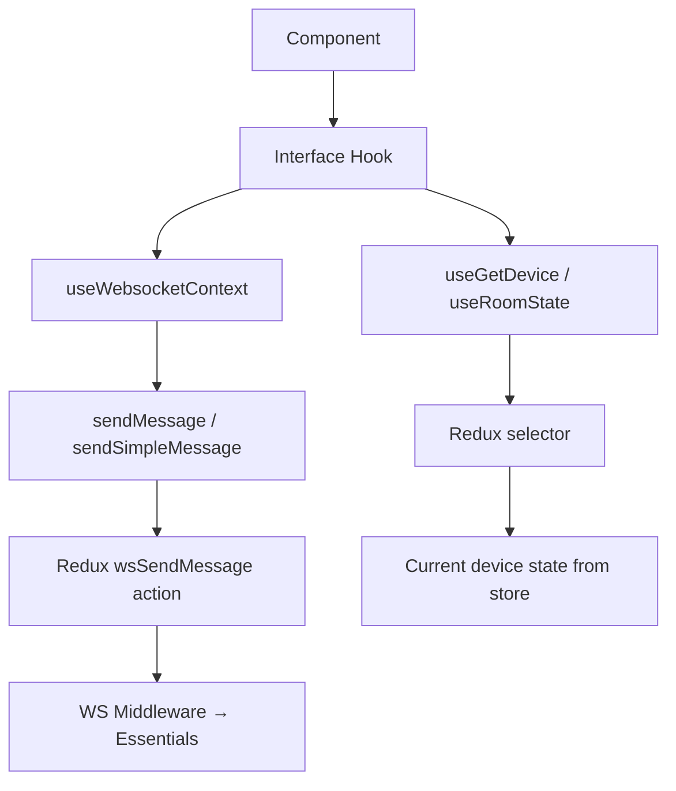

# Interface Hooks — Contributor Guide

**Relates to:** [Issue #94](https://github.com/PepperDash/mobile-control-react-app-core/issues/94) · [Document Mobile Control data flow #89](https://github.com/PepperDash/mobile-control-react-app-core/issues/89)

Guide for authoring new interface hooks in `src/lib/shared/hooks/interfaces/`.

**Key sources:**
- `src/lib/shared/hooks/interfaces/` — all existing hooks
- `src/lib/shared/hooks/useButtonHeldHeartbeat.ts`
- `src/lib/shared/hooks/usePressHoldRelease.ts`

---

## Naming Convention

- File: `useI{EssentialsInterfaceName}.ts`
- Function: `useI{EssentialsInterfaceName}(key: string)`
- Return interface: `I{EssentialsInterfaceName}Return` (new hooks use `*Return`; legacy hooks in this directory may use `*Props` — do not rename existing interfaces)
- The name must match the C# interface in [Essentials](https://github.com/PepperDash/Essentials) (e.g., `IHasPowerControl` → `useIHasPowerControl`)

---

## Internal Architecture



---

## Pattern 1 — Action-Only Hook

Use when the Essentials interface has no feedback state (commands only).

```typescript
// src/lib/shared/hooks/interfaces/useIHasPowerControl.ts
import { useWebsocketContext } from '../../../utils/useWebsocketContext';

export function useIHasPowerControl(key: string): IHasPowerWithFeedbackProps {
  const { sendMessage } = useWebsocketContext();

  const powerOn = () => sendMessage(`/device/${key}/powerOn`, null);
  const powerOff = () => sendMessage(`/device/${key}/powerOff`, null);
  const powerToggle = () => sendMessage(`/device/${key}/powerToggle`, null);

  return { powerOn, powerOff, powerToggle };
}

export interface IHasPowerWithFeedbackProps {
  powerOn: () => void;
  powerOff: () => void;
  powerToggle: () => void;
}
```

**Rules:**
- Never returns `undefined` — actions are always available
- Use `sendMessage(path, null)` for command-only messages
- Use `sendSimpleMessage(path, value)` for scalar payloads (wraps as `{ value }`)
- Use `sendMessage(path, object)` for structured payloads

---

## Pattern 2 — State + Action Hook

Use when the Essentials interface has both commands and feedback state.

```typescript
// src/lib/shared/hooks/interfaces/useILightingScenes.ts
import { useGetDevice } from '../../../store';
import { LightingScene, LightingState } from '../../../types';
import { useWebsocketContext } from '../../../utils/useWebsocketContext';

export function useILightingScenes(key: string): ILightingScenesReturn | undefined {
  const { sendMessage } = useWebsocketContext();
  const state = useGetDevice<LightingState>(key);

  // Return undefined until state arrives — component must guard for this
  if (!state) return undefined;

  const setScene = (scene: LightingScene) =>
    sendMessage(`/device/${key}/selectScene`, scene);

  return { lightingState: state, selectScene: setScene };
}

export interface ILightingScenesReturn {
  lightingState: LightingState;
  selectScene: (scene: LightingScene) => void;
}
```

**Rules:**
- Return type must be `ReturnType | undefined`
- Guard with `if (!state) return undefined;` before building actions
- Use `useGetDevice<T>(key)` for device state; `useRoomState<T>(key)` for room state
- The state type (`LightingState`) must be defined in `src/lib/types/state/state/`

---

## Pattern 3 — Press / Hold / Release Hook

Use when the Essentials interface has physical-button-style commands (press, hold, release).

```typescript
// src/lib/shared/hooks/interfaces/useITransport.ts
import { useButtonHeldHeartbeat } from '../useButtonHeldHeartbeat';
import { PressHoldReleaseReturn } from '../usePressHoldRelease';

export function useITransport(key: string): ITransportProps {
  const path = `/device/${key}`;

  const play  = useButtonHeldHeartbeat(path, 'play');
  const pause = useButtonHeldHeartbeat(path, 'pause');
  const stop  = useButtonHeldHeartbeat(path, 'stop');

  return { play, pause, stop };
}

export interface ITransportProps {
  play:  PressHoldReleaseReturn;
  pause: PressHoldReleaseReturn;
  stop:  PressHoldReleaseReturn;
}
```

**`useButtonHeldHeartbeat(path, command)` behavior:**
- `onPointerDown` → sends `{ value: 'pressed' }` to `{path}/{command}`, then sends `{ value: 'held' }` every **250 ms**
- `onPointerUp` / `onPointerLeave` → sends `{ value: 'released' }`, clears the interval

**When to use `usePressHoldRelease` directly:**
Use `usePressHoldRelease` (lower level) when you need `onHold` or `onPressedButNotHeld` callbacks without the automatic heartbeat — for example, long-press to reveal a menu.

---

## Path Conventions

| Target                     | Path                             |
| -------------------------- | -------------------------------- |
| Device command             | `` `/device/${key}/{command}` `` |
| Room command               | `` `/room/${key}/{command}` ``   |
| Camera command (exception) | `` `/camera/{command}` ``        |

> Most hooks take `key: string` and build the full path internally. Some hooks accept a pre-built `path` string (e.g., `useIBasicVolume`) for flexibility between device and room targets.

---

## State Type Requirements

For a state+action hook, the device state type must:

1. Live in `src/lib/types/state/state/{TypeName}.ts`
2. Extend `DeviceState` (or `RoomState` for room-scoped interfaces)
3. Be exported from `src/lib/types/state/state/index.ts`
4. Be exported from `src/lib/types/index.ts`

```typescript
// src/lib/types/state/state/MyDeviceState.ts
import { DeviceState } from './DeviceState';

export interface MyDeviceState extends DeviceState {
  isActive: boolean;
  level: number;
}
```

---

## Export Requirements

After creating a hook, add it to both export files:

### `src/lib/shared/hooks/interfaces/index.ts`
```typescript
export * from './useIMyNewInterface';
```

### `src/lib/shared/hooks/interfaces/interfaceNames.ts`
Add the interface name to the `InterfaceNames` union type if it corresponds to a named Essentials interface:
```typescript
export type InterfaceNames =
  | "IBasicVolumeWithFeedback"
  | "IMyNewInterface"       // ← add here
  | string;
```

---

## Composite Hooks

When a device or component needs multiple interfaces combined, build a composite hook that calls the individual interface hooks internally:

```typescript
// useTwoWayDisplayBase.ts — combines power + input selection + state
export function useTwoWayDisplayBase(key: string): TwoWayDisplayBaseReturn | undefined {
  const displayState = useGetDevice<DisplayState>(key);
  const powerControl = useIHasPowerControl(key);         // action-only
  const inputControl = useIHasSelectableItems<IHasInputsState>(key); // state+action

  if (!displayState) return undefined;

  const powerOnFb  = (displayState.powerState || displayState.isWarming) && !displayState.isCooling;
  const powerOffFb = (!displayState.powerState || displayState.isCooling) && !displayState.isWarming;

  return { displayState, powerControl, inputControl: inputControl!, powerFb: { powerOnFb, powerOffFb } };
}
```

**Rules for composite hooks:**
- Name with the Essentials base class, not an interface (e.g., `useTwoWayDisplayBase`, `useCameraBase`)
- Guard on the primary state object; delegate action logic to the constituent hooks
- Do not duplicate `sendMessage` calls that are already in a constituent hook

---

## Checklist for New Interface Hooks

- [ ] File in `src/lib/shared/hooks/interfaces/useI{InterfaceName}.ts`
- [ ] Function name matches Essentials interface exactly
- [ ] Exported return interface defined in the same file
- [ ] State type (if needed) defined in `src/lib/types/state/state/`
- [ ] Exported from `src/lib/shared/hooks/interfaces/index.ts`
- [ ] Interface name added to `interfaceNames.ts` (if applicable)
- [ ] `npm run build` passes with no errors
- [ ] `npm run lint` passes with 0 warnings
