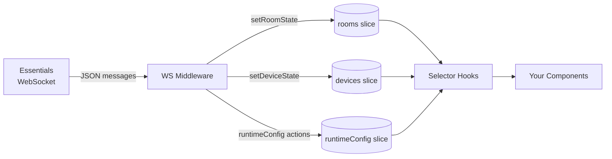

# Redux State — App Developer Guide

**Relates to:** [Issue #92](https://github.com/PepperDash/mobile-control-react-app-core/issues/92) · [Document Mobile Control data flow #89](https://github.com/PepperDash/mobile-control-react-app-core/issues/89)

The library manages all runtime data in a Redux store provided by `MobileControlProvider`. You never interact with Redux directly — instead, the library exports typed selector hooks for reading state and interface hooks (or `useWebsocketContext`) for triggering changes.

---

## Store Shape at a Glance

```
store
├── appConfig      — static config loaded from _config.local.json
├── runtimeConfig  — WebSocket connection, room key, clientId, device interface map
├── rooms          — Record<roomKey, RoomState>       ← pushed by Essentials
├── devices        — Record<deviceKey, DeviceState>   ← pushed by Essentials
└── ui             — modals, popovers, error messages, sync state
```

State in `rooms` and `devices` is populated entirely by messages from [Essentials](https://github.com/PepperDash/Essentials) over WebSocket. Your app never writes to these slices directly.



---

## Reading Device State

### `useGetDevice<T>(deviceKey)`

Returns the typed state for a single device, or `undefined` until the first message arrives.

```tsx
import { useGetDevice } from 'mobile-control-react-app-core';
import type { DisplayState } from 'mobile-control-react-app-core';

function DisplayStatus({ deviceKey }: { deviceKey: string }) {
  const display = useGetDevice<DisplayState>(deviceKey);

  if (!display) return <span>Loading…</span>;

  return <span>Power: {display.powerState ? 'On' : 'Off'}</span>;
}
```

Pass a TypeScript interface as the generic to get full type safety. If you do not know the exact interface, omit the generic and receive `DeviceState` (a loose base type).

### `useGetAllDevices()`

Returns `Record<string, DeviceState>` — every device key currently in the store.

```tsx
const devices = useGetAllDevices();
Object.entries(devices).forEach(([key, state]) => { /* ... */ });
```

---

## Reading Room State

### `useRoomState<T>(roomKey)` / `useGetRoom<T>(roomKey)`

Both are the same hook. Returns the full room state or `undefined`.

```tsx
import { useRoomState } from 'mobile-control-react-app-core';

function RoomPower({ roomKey }: { roomKey: string }) {
  const room = useRoomState(roomKey);
  return <span>{room?.isOn ? 'Room On' : 'Room Off'}</span>;
}
```

### Focused Room Selector Hooks

Use these rather than `useRoomState` when you only need one piece of data — they re-render the component only when that specific value changes.

| Hook                                    | Returns                                      |
| --------------------------------------- | -------------------------------------------- |
| `useRoomState(roomKey)`                 | Full room state                              |
| `useRoomConfiguration(roomKey)`         | Room config (devices, sources, destinations) |
| `useRoomVolume(roomKey, volumeKey)`     | `Volume` object for a named zone             |
| `useRoomLevelControls(roomKey)`         | `LevelControlsState`                         |
| `useRoomName(roomKey)`                  | Room display name                            |
| `useRoomIsOn(roomKey)`                  | `boolean`                                    |
| `useRoomInCall(roomKey)`                | `boolean`                                    |
| `useRoomIsWarmingUp(roomKey)`           | `boolean`                                    |
| `useRoomIsCoolingDown(roomKey)`         | `boolean`                                    |
| `useRoomSourceList(roomKey)`            | Array of available sources                   |
| `useRoomDestinations(roomKey)`          | Destination map                              |
| `useRoomDestinationList(roomKey)`       | Array of destinations                        |
| `useRoomEnvironmentalDevices(roomKey)`  | Environmental device list                    |
| `useRoomShareState(roomKey)`            | Share state                                  |
| `useRoomAdvancedSharingActive(roomKey)` | `boolean`                                    |

---

## Reading Runtime Config

These hooks expose connection metadata populated during the WebSocket handshake.

| Hook                                                   | Returns                                                          |
| ------------------------------------------------------ | ---------------------------------------------------------------- |
| `useWsIsConnected()`                                   | `boolean \| undefined` — `undefined` until first connect attempt |
| `useRoomKey()`                                         | Active room key string                                           |
| `useClientId()`                                        | Session client ID assigned by Essentials                         |
| `useSystemUuid()`                                      | Processor system UUID                                            |
| `useUserCode()`                                        | User access code                                                 |
| `useTouchpanelKey()`                                   | Key identifying this touchpanel instance                         |
| `useIsTouchpanel()`                                    | `boolean`                                                        |
| `useRuntimeInfo()`                                     | Plugin/Essentials version strings                                |
| `useDeviceInterfaceSupport()`                          | Full `Record<deviceKey, DeviceInterfaceInfo>` map                |
| `useInterfacesForDevice(deviceKey)`                    | Interface list for one device                                    |
| `useDeviceSupportsInterface(deviceKey, interfaceName)` | `boolean`                                                        |

---

## Reading App Config

These reflect the values in `_config.local.json` loaded at startup.

| Hook                   | Returns                            |
| ---------------------- | ---------------------------------- |
| `useAppConfig()`       | Full `AppConfig` object            |
| `useApiPath()`         | API base URL                       |
| `useLogoPath()`        | Logo asset path                    |
| `usePartnerMetadata()` | Optional partner branding metadata |

---

## Reading UI State

| Hook                                    | Returns                                              |
| --------------------------------------- | ---------------------------------------------------- |
| `useShowModal(modalType)`               | `boolean` visibility for a named modal               |
| `useShowShutdownModal()`                | `boolean`                                            |
| `useShowIncomingCallModal()`            | `boolean`                                            |
| `useShowPopoverById(group, id)`         | `boolean` visibility for a named popover             |
| `useGetCurrentPopoverIdForGroup(group)` | ID of the currently open popover in a group          |
| `useError()`                            | Current error message string                         |
| `useShowReconnect()`                    | `boolean` — reconnect banner visible                 |
| `useTheme()`                            | Active theme string                                  |
| `useIsSyncStateValuePresent(value)`     | Whether a sync token has been registered (see below) |

---

## Sync State

`syncState` is an array of string tokens used to track whether components have completed their initial data load. It works as a primitive readiness flag: components add a token when they start waiting and remove it when data has arrived.

```tsx
import { useIsSyncStateValuePresent } from 'mobile-control-react-app-core';

// True while at least one component is still waiting for initial data
const isLoading = useIsSyncStateValuePresent('myComponent:loading');
```

> You will generally not need to manage sync state yourself. The library's built-in hooks handle it internally. See [device-state-feedback-app-dev.md](./device-state-feedback-app-dev.md) for the loading pattern.

---

## Getting the Room Key

Most selector hooks require a `roomKey`. Get the active room key from `runtimeConfig`:

```tsx
import { useRoomKey, useRoomState } from 'mobile-control-react-app-core';

function MyRoomWidget() {
  const roomKey = useRoomKey();
  const room = useRoomState(roomKey);

  if (!room) return null;
  return <span>{room.name}</span>;
}
```

---

## What You Do Not Need to Do

- **Do not import or use the Redux `store` object directly.** All state access is through selector hooks.
- **Do not dispatch `setRoomState` or `setDeviceState`.** These are written by the WebSocket middleware when messages arrive from Essentials.
- **Do not configure the Redux provider.** `MobileControlProvider` wraps the store automatically — just render your app inside it.

```tsx
// All you need:
import { MobileControlProvider } from 'mobile-control-react-app-core';

function Root() {
  return (
    <MobileControlProvider config={appConfig}>
      <App />
    </MobileControlProvider>
  );
}
```
