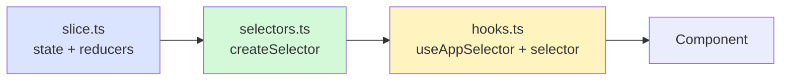
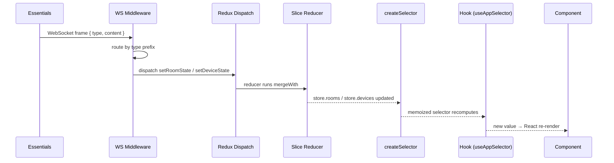

# Redux State — Contributor Reference

**Relates to:** [Issue #92](https://github.com/PepperDash/mobile-control-react-app-core/issues/92) · [Document Mobile Control data flow #89](https://github.com/PepperDash/mobile-control-react-app-core/issues/89)

> [!IMPORTANT]
> **Needs Verification** — The `setDeviceState` key extraction logic in [`devices.slice.ts`](../src/lib/store/devices/devices.slice.ts) uses `type.lastIndexOf('/')` to derive the store key from the WebSocket message type. This works correctly only if Essentials sends device state as `/device/{deviceKey}` (i.e., the device key is the *last* segment). If the message type ever includes a trailing command segment (e.g., `/device/Speaker1/volumeUp`), the extracted key would be `volumeUp` instead of `Speaker1`. Confirm the actual Essentials message format before relying on this detail. See the [devices slice section](#devices) below.

Internal architecture of the Redux store: how the store is composed, how each slice is structured, how selectors are built, and how to add new state.

**Key sources:**
- `src/lib/store/store.ts` — store composition
- `src/lib/store/hooks.ts` — typed dispatch/selector hooks
- `src/lib/store/*/` — slice, selector, and hook modules per domain
- `src/lib/store/middleware/websocketMiddleware.ts` — the only custom middleware

---

## Store Composition

**Source:** `src/lib/store/store.ts`

```typescript
const rootReducer = combineReducers({
  appConfig:     appConfigReducer,
  runtimeConfig: runtimeConfigReducer,
  rooms:         roomsReducer,
  devices:       devicesReducer,
  ui:            uiReducer,
});

export const store = configureStore({
  reducer: rootReducer,
  middleware: (getDefaultMiddleware) =>
    getDefaultMiddleware({
      serializableCheck: {
        ignoredActions: ['websocket/addEventHandler'],
      },
    }).concat(createWebSocketMiddleware()),
});
```

`serializableCheck` is relaxed for `websocket/addEventHandler` because that action carries a callback function reference (non-serializable), which is necessary for the event handler registration API.

### Typed Hooks

**Source:** `src/lib/store/hooks.ts`

```typescript
export const useAppDispatch = useDispatch.withTypes<AppDispatch>();
export const useAppSelector = useSelector.withTypes<RootState>();
```

All selector hooks and action hooks inside the library use `useAppSelector` and `useAppDispatch` rather than raw `useSelector`/`useDispatch`. **Always use these typed wrappers in new code.**

---

## Slice Architecture

Each domain follows the same three-file pattern:

```
{domain}/
├── {domain}.slice.ts      ← createSlice: state shape, reducers, action creators
├── {domain}.selectors.ts  ← createSelector: memoized read queries
└── {domain}.hooks.ts      ← React hooks: useAppSelector + selector
```



---

## Slice Reference

### `appConfig`

**Source:** `src/lib/store/appConfig/appConfig.slice.ts`

Holds the static configuration loaded from `_config.local.json` at app startup. Written once via `setAppConfig`; never updated by WebSocket messages.

| Field                     | Type                              | Description                      |
| ------------------------- | --------------------------------- | -------------------------------- |
| `config.apiPath`          | `string`                          | HTTP base URL for Essentials API |
| `config.gatewayAppPath`   | `string`                          | Gateway app URL path             |
| `config.logoPath`         | `string`                          | Logo asset path                  |
| `config.iconSet`          | `'GOOGLE' \| 'HABANERO' \| 'NEO'` | Icon theme                       |
| `config.loginMode`        | `string`                          | Authentication mode              |
| `config.enableDev`        | `boolean`                         | Show developer tools             |
| `config.modes`            | `Record<string, unknown>`         | Feature flags                    |
| `config.partnerMetadata?` | `PartnerMetadata[]`               | Optional branding                |

**Actions:** `appConfigActions.setAppConfig(config: AppConfig)`

---

### `runtimeConfig`

**Source:** `src/lib/store/runtimeConfig/runtimeConfig.slice.ts`

Populated during the HTTP handshake and updated by incoming WebSocket system messages. Tracks connection state and the metadata returned by `GET /ui/joinroom`.

| Field                                | Type                                  | Source                             |
| ------------------------------------ | ------------------------------------- | ---------------------------------- |
| `token`                              | `string`                              | URL param / sessionStorage         |
| `websocket.isConnected`              | `boolean \| undefined`                | WS open/close events               |
| `currentRoomKey`                     | `string`                              | `/system/roomKey` message          |
| `touchpanelKey`                      | `string`                              | `/system/touchpanelKey` message    |
| `apiVersion`                         | `string`                              | `GET /version` response            |
| `pluginVersion`                      | `string`                              | `GET /version` response            |
| `serverIsRunningOnProcessorHardware` | `boolean`                             | `GET /version` response            |
| `roomData.clientId`                  | `string`                              | `GET /ui/joinroom` response        |
| `roomData.deviceInterfaceSupport`    | `Record<string, DeviceInterfaceInfo>` | `/system/deviceInterfaces` message |
| `roomData.userCode`                  | `string`                              | `/system/userCodeChanged` message  |
| `roomData.qrUrl`                     | `string`                              | `/system/userCodeChanged` message  |

**Actions:** `runtimeConfigActions.*` (see slice file for full list)

---

### `rooms`

**Source:** `src/lib/store/rooms/rooms.slice.ts`

`Record<roomKey, RoomState>` — each entry is the merged state of one room, built up from incremental `/room/{key}/*` WebSocket messages.

#### `setRoomState(message: Message)`

The sole write path. Extracts the room key from the last segment of `message.type` and deep-merges `message.content` into the existing entry:

```typescript
setRoomState(state, action: PayloadAction<Message>) {
  const key = action.payload.type.slice(action.payload.type.lastIndexOf('/') + 1);
  if (!key) return;

  const existingState = state[key] ?? {};
  const newState = _.mergeWith({}, existingState, content, (_obj, src) => {
    if (Array.isArray(src)) return src; // arrays replace, not merge
  });
  state[key] = newState;
}
```

> **Why `mergeWith` with array replacement?** Essentials sends partial snapshots — only changed properties. Plain deep merge would accumulate array items across messages, producing duplicate or stale entries. Replacing arrays on every update guarantees the stored array always matches the last message from the server.

**Actions:** `roomsActions.setRoomState`, `roomsActions.clearRooms`

`clearRooms` is dispatched by the middleware when a `/system/roomKey` message arrives (room context has changed).

---

### `devices`

**Source:** `src/lib/store/devices/devices.slice.ts`

`Record<deviceKey, DeviceState>` — the same pattern as `rooms`. Each entry is built from incremental `/device/{key}/*` messages.

#### `setDeviceState(message: Message)`

Identical logic to `setRoomState`: key extraction from the type string + `mergeWith` array replacement. The only difference is the key maps to `state.devices` rather than `state.rooms`.

```typescript
// Key extraction: "/device/Speaker1" → "Speaker1"
// lastIndexOf('/') always extracts the *last* path segment as the store key.
// If a message type ever includes a trailing segment (e.g. "/device/Speaker1/volumeUp"),
// this logic would store under "volumeUp" instead of "Speaker1".
// In practice, Essentials sends device state as "/device/{deviceKey}" with no trailing segment,
// so the last segment is the device key. Confirm in websocketMiddleware.ts if routing logic changes.
const key = type.slice(type.lastIndexOf('/') + 1);
```

**Actions:** `devicesActions.setDeviceState`, `devicesActions.clearDevices`

`clearDevices` is dispatched alongside `clearRooms` on room context change.

---

### `ui`

**Source:** `src/lib/store/ui/ui.slice.ts`

Manages purely UI-local state: modal visibility, popover open/close, error messages, theme, and the sync state array.

#### Popover Model

Popovers are grouped. Opening a popover in a group automatically closes all others in that group:

```typescript
setPopoverState(state, { payload: { popoverGroup, popoverId, value } }) {
  // close all others in group first
  Object.keys(state.popoverVisibility[popoverGroup] ?? {}).forEach(key => {
    state.popoverVisibility[popoverGroup][key] = false;
  });
  state.popoverVisibility[popoverGroup][popoverId] = value;
}
```

#### Sync State

`syncState: string[]` is a lightweight loading tracker. Components push a string token when they begin waiting for initial data and pop it when data arrives. The UI can use `useIsSyncStateValuePresent(token)` to determine whether a component is still initializing.

```
component mounts
  → dispatch addSyncState('display:loading')

device state arrives
  → dispatch removeSyncState('display:loading')

useIsSyncStateValuePresent('display:loading') === false → render content
```

**Actions:** `uiActions.*` — see slice file for the full list.

---

## Selector Pattern

All selectors use `createSelector` from RTK for memoization. The pattern is consistent across all slices:

```typescript
// 1. Input selector: extract the slice
const devicesSlice = (state: RootState) => state.devices;

// 2. Parameterized factory (for per-key selectors)
export const selectDeviceByKey = (deviceKey: string) =>
  createSelector(devicesSlice, (devices) => devices[deviceKey] ?? undefined);

// 3. Hook wraps it
export function useGetDevice<T>(deviceKey: string): T | undefined {
  return useAppSelector(selectDeviceByKey(deviceKey)) as T | undefined;
}
```

> **Do not call `createSelector` inside a React component.** Calling it per-render creates a new selector instance each time, defeating memoization. Parameterized selectors like `selectDeviceByKey(key)` are factory functions — call them once per stable key and cache the result, which `useAppSelector` handles correctly because the selector reference is stable for a given `key` value.

---

## Full Data Flow Diagram



---

## Adding a New Slice

Follow the three-file pattern for any new domain:

**1. Create the slice** (`src/lib/store/{domain}/{domain}.slice.ts`)

```typescript
import { createSlice, PayloadAction } from '@reduxjs/toolkit';

const initialState: MyDomainState = { /* ... */ };

const myDomainSlice = createSlice({
  name: 'myDomain',
  initialState,
  reducers: {
    setMyValue(state, action: PayloadAction<string>) {
      state.myValue = action.payload;
    },
  },
});

export interface MyDomainState { myValue: string }
export const myDomainActions = myDomainSlice.actions;
export const myDomainReducer = myDomainSlice.reducer;
```

**2. Register in `store.ts`**

```typescript
import { myDomainReducer } from './myDomain/myDomain.slice';

const rootReducer = combineReducers({
  // ... existing slices
  myDomain: myDomainReducer,
});
```

**3. Add `RootState` type** — automatically included since `RootState = ReturnType<typeof store.getState>`.

**4. Create selectors** (`src/lib/store/{domain}/{domain}.selectors.ts`)

```typescript
import { createSelector } from '@reduxjs/toolkit';
import { RootState } from '../..';

const myDomainSlice = (state: RootState) => state.myDomain;

export const selectMyValue = createSelector(
  myDomainSlice,
  (domain) => domain.myValue
);
```

**5. Create hooks** (`src/lib/store/{domain}/{domain}.hooks.ts`)

```typescript
import { useAppSelector } from '../hooks';
import { selectMyValue } from './myDomain.selectors';

export const useMyValue = () => useAppSelector(selectMyValue);
```

**6. Export from `src/lib/store/index.ts`**

```typescript
export * from './myDomain/myDomain.hooks';
export * from './myDomain/myDomain.selectors';
export { myDomainActions } from './myDomain/myDomain.slice';
```

---

## Store Index Exports

**Source:** `src/lib/store/index.ts`

The store barrel file re-exports everything a hook or component inside the library needs to import from `../..` (i.e., the store root). When adding a new slice, export its hooks, selectors, and actions from this file.

**Do not export slice reducer functions** — they are internal implementation details consumed only by `store.ts`.
