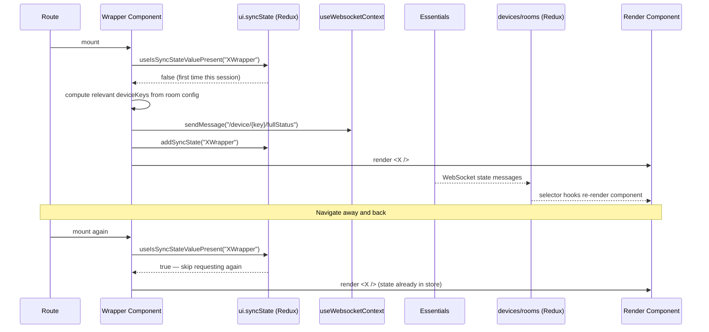

# EXPLANATION: The Wrapper / Render Component Pattern ("Render Props")

**Relates to:** [Issue #97](https://github.com/PepperDash/mobile-control-react-app-core/issues/97) · [Document Mobile Control data flow #89](https://github.com/PepperDash/mobile-control-react-app-core/issues/89)

> **A note on naming:** Consuming apps refer to this as the "render props" pattern, but it is not the classic React render-prop API (a component that accepts a `render`/`children` function). It is a **Wrapper / Render component split** — one component owns data-sync concerns, and a second, separate component owns presentation. This document uses "render props" only because that is the established name for it across PepperDash Mobile Control apps; the mechanics described below are what actually happens.

This pattern is not part of `mobile-control-react-app-core` itself — the library only provides the building blocks (selector hooks, `useWebsocketContext`, `useStateIsSynced`). The pattern is a convention that consuming apps follow when building screens on top of those building blocks. The examples below are `Audio`/`AudioWrapper` and `DisplayControls`/`DisplayControlsWrapper` from `mobile-control-cisco-navigator-momentum-ui` (the same shape [Issue #97](https://github.com/PepperDash/mobile-control-react-app-core/issues/97) asks for from the KPMG app; this repo has the Cisco Navigator app checked out, and it uses the identical pattern with components of the same names).

---

## The Problem It Solves

Every screen in a Mobile Control app needs device state that starts out empty. State only appears in the Redux store after Essentials pushes it over the WebSocket, and Essentials only pushes current state proactively for a device once the app asks for it (via a `fullStatus` request — see [action-paths-app-dev.md](./action-paths-app-dev.md)).

A naive component would request status inside its own render logic, which creates two problems:

- **Re-request storms.** Components re-render often (state changes, route changes, parent re-renders). If the status request lived in the same component that renders controls, it would fire repeatedly instead of once.
- **Mixed responsibilities.** Figuring out *which* device keys are relevant to a screen (by reading room configuration) is a different concern than *rendering* those devices once their state exists.

The Wrapper / Render split exists to keep those two concerns apart.

---

## The Two Halves

### The Wrapper Component

Responsible for:
1. Reading room configuration (`useRoomConfiguration`) and/or interface support (`useDeviceInterfaceSupport`) to determine **which device keys are relevant** to this screen.
2. Requesting full status for those device keys, **exactly once per session**, using the sync-state guard described below.
3. Rendering the Render component (and nothing else — no presentation logic).

### The Render Component

Responsible for:
1. Reading already-populated state back out of the Redux store via selector hooks (`useGetAllDevices`, `useGetDevice`, room selector hooks, etc.).
2. Rendering UI from that state.
3. Nothing about *how* or *when* that state was requested — it assumes the Wrapper has already taken care of it.

This is the same idea as a container/presentational split, but the "container" half has one narrow job: make sure state exists, once.

---

## Walkthrough: `AudioWrapper` / `Audio`

From `mobile-control-cisco-navigator-momentum-ui`:

```tsx
// AudioWrapper.tsx — the Wrapper
export const AudioWrapper = ({ className, variant }: AudioWrapperProps) => {
  const { sendMessage } = useWebsocketContext();
  const roomKey = useRoomKey();
  const config = useRoomConfiguration(roomKey);

  const [setSyncStateRequested, , syncStateRequested] =
    useStateIsSynced("AudioWrapper");

  useEffect(() => {
    if (!config || syncStateRequested) return;

    const deviceKeysSet: Set<string> = new Set<string>();
    const levelControls = config.audioControlPointList?.levelControls;

    if (levelControls && config.audioControlPointList) {
      Object.values(levelControls).forEach((lcl) => {
        deviceKeysSet.add(
          lcl.itemKey ? `${lcl.parentDeviceKey}--${lcl.itemKey}` : lcl.parentDeviceKey
        );
      });
    }

    deviceKeysSet.forEach((dk) => {
      sendMessage(`/device/${dk}/fullStatus`, { deviceKey: dk });
    });

    setSyncStateRequested();
  }, [config]);

  return variant === "dangerFeedback"
    ? <AudioDangerFeedback className={className} />
    : <Audio className={className} />;
};
```

```tsx
// Audio.tsx — the Render component
const Audio = ({ className }: AudioProps) => {
  const roomKey = useRoomKey();
  const audioControlPoints = useRoomAudioControlPointList(roomKey);

  if (!audioControlPoints) return null; // state not populated yet

  const { levelControls, presets } = audioControlPoints;
  // ...renders faders, mutes, and presets from levelControls/presets
};
```

`AudioWrapper` never renders a fader or a mute button itself. `Audio` never calls `sendMessage`. Each component only has one reason to change.

---

## Walkthrough: `DisplayControlsWrapper` / `DisplayControls`

This example shows the "which device keys are relevant" step in more depth — it is not always as simple as reading one list off of `config`:

```tsx
export const DisplayControlsWrapper = ({ className }: DisplayControlsProps) => {
  const { sendMessage } = useWebsocketContext();
  const roomKey = useRoomKey();
  const config = useRoomConfiguration(roomKey);
  const deviceInterfaceSupport = useDeviceInterfaceSupport();

  const [setSyncStateRequested, , syncStateRequested] = useStateIsSynced(
    "DisplayControlsWrapper"
  );

  useEffect(() => {
    if (!config || !deviceInterfaceSupport || syncStateRequested) return;

    const deviceKeysSet: Set<string> = new Set<string>();

    // Accessory devices that implement a display-related interface (e.g. screen lifts)
    const { accessoryDeviceKeys } = config;
    if (accessoryDeviceKeys?.length) {
      Object.entries(deviceInterfaceSupport)
        .filter(([key]) => accessoryDeviceKeys.includes(key))
        .filter(([, value]) => value.interfaces.includes("IProjectorScreenLiftControl"))
        .forEach(([key]) => deviceKeysSet.add(key));
    }

    // Plus every destination sink defined in room config
    if (config.destinationList) {
      Object.values(config.destinationList).forEach((dli) => deviceKeysSet.add(dli.sinkKey));
    }

    deviceKeysSet.forEach((dk) => {
      sendMessage(`/device/${dk}/fullStatus`, { deviceKey: dk });
      setSyncStateRequested();
    });
  }, [config, deviceInterfaceSupport]);

  return <DisplayControls className={className} />;
};
```

The Wrapper combines two sources — `config.accessoryDeviceKeys` filtered by interface support, and `config.destinationList` — to build the full set of device keys the screen cares about. `DisplayControls` (the Render half) only needs to know about `useRoomDestinations` and `useGetAllDevices`; it has no idea how those keys were determined to be relevant.

Here is the Render half in full:

```tsx
// DisplaysControls.tsx — the Render component
const DisplayControls = ({ className }: DisplayControlsProps) => {
  const [selectedDisplay, setSelectedDisplay] = useState<DisplayState>();
  const roomKey = useRoomKey();

  const destinations = useRoomDestinations(roomKey);
  const deviceStates = useGetAllDevices();

  // Filter out destinations that are not controllable displays
  const displays = useMemo(() => {
    if (!destinations || !deviceStates) return undefined; // state not populated yet
    const controllableDisplays = Object.entries(destinations).filter(
      ([key]) => key !== "programAudio" && key !== "codecContent"
    );
    const displayKeys = controllableDisplays.map(([, value]) => value);
    const displayStates = Object.values(deviceStates).filter((device) =>
      Object.values(displayKeys).includes(device.key)
    );
    return displayStates as DisplayState[];
  }, [destinations, deviceStates]);

  // Once displays populate, default the selection to the first one
  useEffect(() => {
    if (!displays || !displays.length) return;
    if (!selectedDisplay) setSelectedDisplay(displays[0]);
  }, [selectedDisplay, displays]);

  return (
    <div className={className}>
      <DisplayList displays={displays} selectedDisplay={selectedDisplay} setSelectedDisplay={setSelectedDisplay} />
      <Controls displayKey={selectedDisplay?.key} />
    </div>
  );
};
```

Two things worth calling out about the Render half's shape:

- **The empty-state gate is `undefined`, not `[]`.** `displays` starts as `undefined` (not yet computable — either `destinations` or `deviceStates` is still empty) and only becomes an array once both selectors have data. `DisplayList`/`Controls` can therefore tell "not populated yet" apart from "populated, and there happen to be zero displays."
- **`useGetAllDevices`/`useRoomDestinations` read the *same* Redux store the Wrapper's `sendMessage` calls eventually populate.** The Render component doesn't subscribe to the WebSocket or the sync guard at all — it just re-renders, via normal selector-hook reactivity, whenever Essentials' `fullStatus` reply lands in the store. The `useMemo`/`useEffect` above run again each time `destinations` or `deviceStates` changes, which is what turns "state arrived" into "a display is now selected and rendered."

---

## How the Sync Guard Prevents Duplicate Requests

`useStateIsSynced(name)` is a thin wrapper (from `mobile-control-react-app-core`) around a single `ui.syncState: string[]` array in the Redux store:

```typescript
// src/lib/store/ui/ui.slice.ts
addSyncState(state, action: PayloadAction<string>) {
  if (!state.syncState.includes(action.payload)) {
    state.syncState.push(action.payload);
  }
},
removeSyncState(state, action: PayloadAction<string>) {
  state.syncState = state.syncState.filter((v) => v !== action.payload);
},
```

```typescript
// src/lib/shared/hooks/useStateIsSynced.ts
export function useStateIsSynced(name: string): [() => void, () => void, boolean] {
  const dispatch = useAppDispatch();
  return [
    () => dispatch(uiActions.addSyncState(name)),
    () => dispatch(uiActions.removeSyncState(name)),
    useIsSyncStateValuePresent(name),
  ];
}
```

A Wrapper calls this hook with a name unique to itself (by convention, the component's own name, e.g. `"AudioWrapper"`). The third tuple value is `true` once that name has been added to `syncState` and stays `true` for the lifetime of the Redux store — i.e., for the rest of the session, or until something explicitly calls `removeSyncState`/`clearSyncState`. The `useEffect` guard (`if (!config || syncStateRequested) return;`) means the `fullStatus` requests inside it can only ever run one time per name, no matter how many times the Wrapper re-renders or remounts (e.g. navigating away from and back to `/audio`).

This is why the requests are "once per session" rather than "once per mount": the guard lives in the Redux store, not in component-local state (a `useRef`, for example, would reset on unmount; `syncState` does not).

Two caveats worth knowing:

- **The guard is keyed on the Wrapper's name, not on the device key.** `syncState` only remembers "has `AudioWrapper` run its request logic," not "has device X been requested." If two different Wrappers both happen to include the same device key (e.g. a device that is both an audio control point and a destination sink), each Wrapper still sends its own `fullStatus` for that key the first time it runs — the guard prevents *a given Wrapper* from re-requesting, not the app-wide duplicate. Essentials handles the redundant `fullStatus` fine, but the "we only request state for a given device once per session" description is an approximation, not a hard guarantee.
- **Call `setSyncStateRequested()` once, after the loop, not inside it.** The `AudioWrapper` example above does this correctly. The `DisplayControlsWrapper` example calls it inside `deviceKeysSet.forEach`, which is harmless when the set is non-empty (it just sets the same guard repeatedly) but means the guard is never set at all if `deviceKeysSet` ends up empty — the Wrapper would then recompute and pointlessly re-check every re-render. Prefer the `AudioWrapper` placement in new code.

> See [redux-state-contributors.md](./redux-state-contributors.md#sync-state) for the full `ui` slice reference, and [device-state-feedback-app-dev.md](./device-state-feedback-app-dev.md) for the related `useGetAllDeviceStateFromRoomConfiguration` helper, which automates the same "collect device keys from room config, request `fullStatus` once" idea for the common case. Note that its guard is a component-local `useRef`, not the Redux `syncState` array — so it dedupes requests once per mount, not once per session. Reach for the Wrapper/Render pattern (with `useStateIsSynced`) instead of that helper when a screen is likely to unmount and remount (e.g. behind app routing) and you want to avoid re-requesting `fullStatus` on every return visit.

---

## Full Lifecycle



---

## When to Use This Pattern

Use a Wrapper/Render split whenever a screen needs to request device state that isn't already guaranteed to be populated (e.g., anything not covered by the automatic room `status` request described in [device-state-feedback-app-dev.md](./device-state-feedback-app-dev.md)). Conventions to follow:

- Name the Wrapper `<ScreenName>Wrapper` and export it; keep the Render component's default export un-suffixed (`Audio`, `DisplayControls`).
- Give `useStateIsSynced` a name that is unique across the app — the component's own name is sufficient and keeps the guard readable in Redux DevTools.
- Put the `useEffect` device-key computation and `sendMessage` calls only in the Wrapper. The Render component should never call `sendMessage` to request its own initial data.
- Register only the Wrapper in routing (see `TechControls.tsx`), never the Render component directly.
- Call `setSyncStateRequested()` once, after the device-key loop finishes (not inside it) — see the caveat above.
