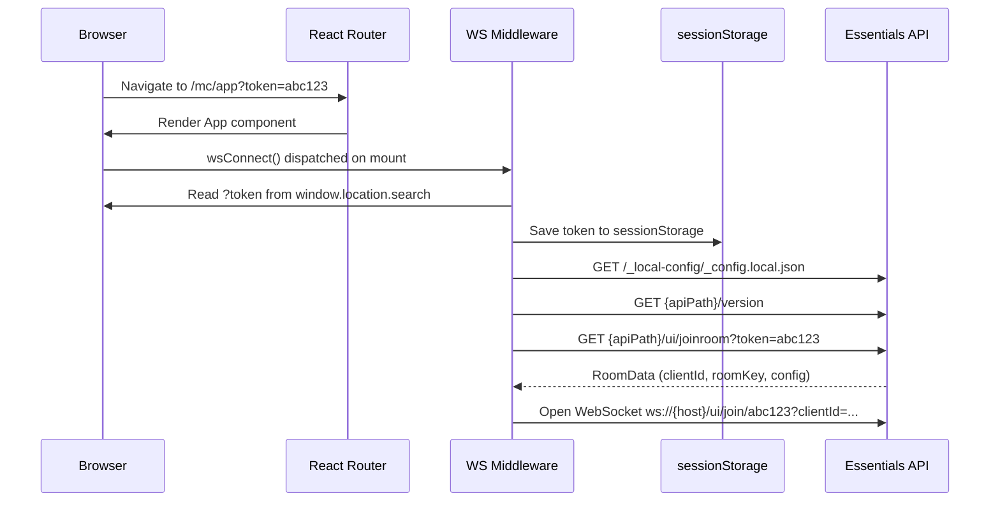

# URL Routing — App Developer Guide

**Relates to:** [Issue #96](https://github.com/PepperDash/mobile-control-react-app-core/issues/96) · [Document Mobile Control data flow #89](https://github.com/PepperDash/mobile-control-react-app-core/issues/89)

React apps built on this library use [React Router v6](https://reactrouter.com/en/main) for URL-based navigation. The library uses React Router hooks internally (error handling, navigation), so **a router must be present** in the app's component tree — `MobileControlProvider` alone is not sufficient.

---

## Required Setup

Use `createBrowserRouter` from `react-router-dom` to create a router with `basename: '/mc/app'`, then wrap your app with `RouterProvider` **outside** `MobileControlProvider`:

```tsx
// src/index.tsx
import React from 'react';
import { createRoot } from 'react-dom/client';
import { RouterProvider, createBrowserRouter } from 'react-router-dom';
import App from './app/App';
import { ErrorBox } from 'mobile-control-react-app-core';

const router = createBrowserRouter(
  [
    { path: '*', Component: App, errorElement: <ErrorBox /> },
  ],
  {
    basename: '/mc/app',
  }
);

const container = document.getElementById('root')!;
createRoot(container).render(
  <React.StrictMode>
    <RouterProvider router={router} />
  </React.StrictMode>
);
```

```tsx
// src/app/App.tsx
import { MobileControlProvider } from 'mobile-control-react-app-core';
import MyRoomUI from './MyRoomUI';

function App() {
  return (
    <MobileControlProvider>
      <MyRoomUI />
    </MobileControlProvider>
  );
}

export default App;
```

> The `path: '*'` wildcard ensures React Router does not 404 on any sub-path under `/mc/app/`.

---

## URL Structure

All app URLs live under the `/mc/app` base path. The connection token is passed as a query parameter:

```
http://{host}/mc/app?token={token}
```

| Part             | Description                                                   |
| ---------------- | ------------------------------------------------------------- |
| `/mc/app`        | Fixed base path for all Mobile Control React apps             |
| `?token={token}` | Essentials session token obtained from the Crestron processor |

**Getting a token:** On the Crestron processor, run the console command `mobileinfo:{programSlot}` to retrieve the token for that program slot.

**Example:** `http://192.168.1.22/mc/app?token=abc123xyz`

### Token Persistence

The token is read from the URL on first load and saved to `sessionStorage`. On subsequent WebSocket reconnections within the same browser session, the token is reloaded from `sessionStorage` automatically — you do not need to re-append it to the URL.

---

## Connection Flow



---

## Adding Pages (Sub-Routes)

Use nested `Routes` inside your app component to add navigable pages. The `Suspense` wrapper handles lazy-loaded pages:

```tsx
import { Suspense } from 'react';
import { Route, Routes } from 'react-router-dom';

const RoomPage = () => import('./pages/RoomPage');
const SettingsPage = () => import('./pages/SettingsPage');

function MyRoomUI() {
  return (
    <Suspense fallback={null}>
      <Routes>
        <Route path="/" element={<RoomPage />} />
        <Route path="/settings" element={<SettingsPage />} />
      </Routes>
    </Suspense>
  );
}
```

These paths are relative to the `basename`. The full URLs would be:
- `http://{host}/mc/app/` → `RoomPage`
- `http://{host}/mc/app/settings` → `SettingsPage`

---

## Navigating Between Pages

Use the `useNavigate` hook from `react-router-dom`:

```tsx
import { useNavigate } from 'react-router-dom';

function SettingsButton() {
  const navigate = useNavigate();
  return (
    <button onPointerDown={() => navigate('/settings')}>Settings</button>
  );
}
```

---

## Error Handling

The library exports `ErrorBox`, a pre-built error boundary component for use as the `errorElement` in your route config. It displays the error, provides a "Go Back" button, and a "Reconnect" button.

```tsx
import { ErrorBox } from 'mobile-control-react-app-core';

const router = createBrowserRouter(
  [{ path: '*', Component: App, errorElement: <ErrorBox /> }],
  { basename: '/mc/app' }
);
```

---

## Reconnect Behaviour

When the server sends a close code that requires a new token (e.g., user code changed), the middleware redirects to the `gatewayAppPath` URL configured in `_config.local.json`:

```
{gatewayAppPath}?uuid={systemUuid}&roomKey={roomKey}&Code={userCode}
```

This navigates away from the app to the gateway login page where a new token is obtained. The `gatewayAppPath` must point to the Mobile Control gateway application URL for reconnection to work.

---

## Configuration Reference

**`_config.local.json`** fields relevant to routing:

| Field            | Description                                                                |
| ---------------- | -------------------------------------------------------------------------- |
| `apiPath`        | Base URL for Essentials HTTP API (e.g. `http://192.168.1.22:50010/mc/api`) |
| `gatewayAppPath` | URL of the gateway app, used when reconnecting with a new token            |

See `public/_local-config/_config.default.json` for a complete example.
