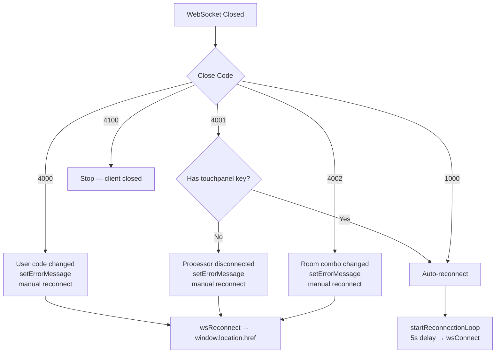

# URL Routing — Contributor Reference

**Relates to:** [Issue #96](https://github.com/PepperDash/mobile-control-react-app-core/issues/96) · [Document Mobile Control data flow #89](https://github.com/PepperDash/mobile-control-react-app-core/issues/89)

Internal details of how URL routing and the `/mc/app` base path interact with the WebSocket middleware, config loading, and reconnect logic.

**Key sources:**
- `src/index.tsx` — router setup (reference app only)
- `src/lib/store/middleware/websocketMiddleware.ts` — token extraction, config base URL, reconnect redirect
- `src/lib/utils/joinParamsService.ts` — sessionStorage read/write helpers
- `src/lib/shared/layout/ErrorBox.tsx` — React Router error boundary component

---

## Why `basename: '/mc/app'`

The Essentials Mobile Control plugin serves the React app under the path `/mc/app` on the Crestron processor's web server. Setting `basename` in `createBrowserRouter` tells React Router to treat `/mc/app` as the root of all route paths, so:

- Route `'*'` matches `/mc/app`, `/mc/app/settings`, etc.
- `useNavigate('/settings')` produces `/mc/app/settings` in the browser
- `<Link to="/settings">` renders an `href` of `/mc/app/settings`

Without `basename`, navigating to any sub-path would require hardcoding the `/mc/app` prefix everywhere.

---

## Token Extraction (WS_CONNECT)

**Source:** `src/lib/store/middleware/websocketMiddleware.ts` — `WS_CONNECT` case

```typescript
case WS_CONNECT: {
  const qp = new URLSearchParams(window.location.search);
  let joinToken = qp.get('token');

  if (joinToken) {
    saveValue(sessionStorageKeys.uuid, joinToken);  // persist for reconnects
  } else {
    joinToken = loadValue(sessionStorageKeys.uuid); // restore from sessionStorage
  }

  state.token = joinToken;
  await initialize(store.dispatch);
  await connect(store.dispatch, store.getState);
  break;
}
```

`window.location.search` is read directly (not via a React Router hook) because the middleware runs outside the React component tree. This is safe — the token only needs to be read once at connection time, not reactively.

`saveValue` / `loadValue` are thin wrappers around `sessionStorage` from `joinParamsService.ts`. The token survives page refreshes within the same browser session but is cleared when the tab closes.

---

## Config Base URL Derivation

**Source:** `websocketMiddleware.ts` — `initialize()` function

The config file is fetched relative to the app's deployment path. The middleware derives this from `location.pathname`:

```typescript
const basePath = location.pathname
  .split('/')
  .filter((path) => path.length > 0);

if (basePath.length >= 5) {
  basePath.length = 5;   // gateway-style deep path (5 segments)
} else {
  basePath.length = 2;   // standard /mc/app → ['mc', 'app']
}

const baseURL = `/${basePath.join('/')}`;
// → "/mc/app" for standard deployment

await httpClient.get('/_local-config/_config.local.json', { baseURL });
// → fetches /mc/app/_local-config/_config.local.json
```

The `5-segment` branch handles deeper gateway deployment paths (e.g., `/gateway/v2/mc/app/room`). If the path has fewer than 5 segments, it truncates to 2, which covers the standard `/mc/app` case.

> If the deployment path changes (e.g., a white-label build uses `/control/app`), this logic still works as long as `_local-config/_config.local.json` is served relative to the app base.

---

## Reconnect URL Construction

**Source:** `websocketMiddleware.ts` — `reconnect()` function

Called when `WS_RECONNECT` is dispatched (e.g., after a user code change). Redirects the browser to the gateway login page using values from the Redux store:

```typescript
const reconnect = (getState: () => LocalRootState) => {
  const { gatewayAppPath } = rootState.appConfig.config;
  const roomKey = rootState.runtimeConfig.roomData.roomKey;
  const systemUuid = rootState.runtimeConfig.roomData.systemUuid;
  const userCode = rootState.runtimeConfig.roomData.userCode;

  const newUrl = `${gatewayAppPath}?uuid=${systemUuid}&roomKey=${roomKey}`;
  window.location.href = userCode ? `${newUrl}&Code=${userCode}` : newUrl;
};
```

This is a full page navigation (`window.location.href`), not a React Router navigation, because:

1. The destination (`gatewayAppPath`) is a different application entirely — not a route within this app.
2. A hard redirect clears session state cleanly before the user re-authenticates.

---

## Close Codes and Router Impact

Certain WebSocket close codes trigger behaviours that interact with routing:

| Close Code | Behaviour                   | Router Impact                                                                |
| ---------- | --------------------------- | ---------------------------------------------------------------------------- |
| `4000`     | User code changed           | Shows error, manual reconnect → `reconnect()` → redirect to `gatewayAppPath` |
| `4001`     | Server-initiated close      | Auto-reconnects (no redirect); touchpanel key presence determines strategy   |
| `4002`     | Room combination changed    | Shows error, manual reconnect → `reconnect()` → redirect to `gatewayAppPath` |
| `4100`     | Client-requested disconnect | Clean close, no reconnect, no redirect                                       |
| `1000`     | Normal close                | Auto-reconnect via `startReconnectionLoop`                                   |



---

## `ErrorBox` Component

**Source:** `src/lib/shared/layout/ErrorBox.tsx`

`ErrorBox` is the route-level error boundary exported from the library. It uses three React Router hooks:

```typescript
import { isRouteErrorResponse, useNavigate, useRouteError } from 'react-router-dom';

const error = useRouteError();        // catches errors thrown by route components
const navigate = useNavigate();       // powers the "Go Back" button → navigate(-1)
isRouteErrorResponse(error)           // distinguishes HTTP-style route errors from JS errors
```

Because it uses these hooks, `ErrorBox` **must** be rendered inside a `RouterProvider` context. It cannot be used outside a React Router tree.

---

## `RoomBusiness` Pattern (Nested Routes)

**Source:** `src/components/roomBusiness/RoomBusiness.tsx`

The reference app includes a `RoomBusiness` component demonstrating how to nest `Routes` inside the main app component for multi-page UIs:

```tsx
import { Suspense } from 'react';
import { Routes } from 'react-router-dom';

const RoomBusiness = () => (
  <Suspense fallback={null}>
    <Routes>
      {/* <Route path="/" element={<SplashPage />} /> */}
      {/* <Route path="/activities" element={<Activities />} /> */}
    </Routes>
  </Suspense>
);
```

This works because the parent router (`createBrowserRouter` in `index.tsx`) uses `path: '*'`, making any sub-path valid at the router level. React Router then delegates matching within `Routes` to the nested route config. `Suspense` wraps it to support lazy-loaded page components.

---

## Dependency Note

`react-router-dom` is listed as both a `devDependency` and `peerDependency` in `package.json` at `^6.21.3`. The `devDependency` makes it available during library development and for the local reference app — it is **not** bundled or shipped to consumers. The `peerDependency` declaration is what signals to consuming apps that they must provide `react-router-dom` themselves.

> **Why this matters:** Misidentifying a `devDependency` as a direct `dependency` could lead a consuming app developer to skip adding `react-router-dom` to their own `dependencies`, assuming the library ships it. It doesn't — omitting it from the consumer's install will cause silent runtime failures.

When bumping the React Router version, update both entries in `package.json` and verify `ErrorBox` and `RoomBusiness` against any breaking changes in the React Router v6 changelog.
