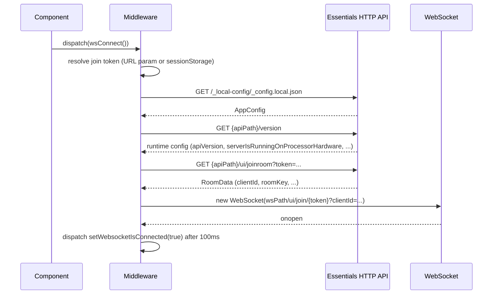
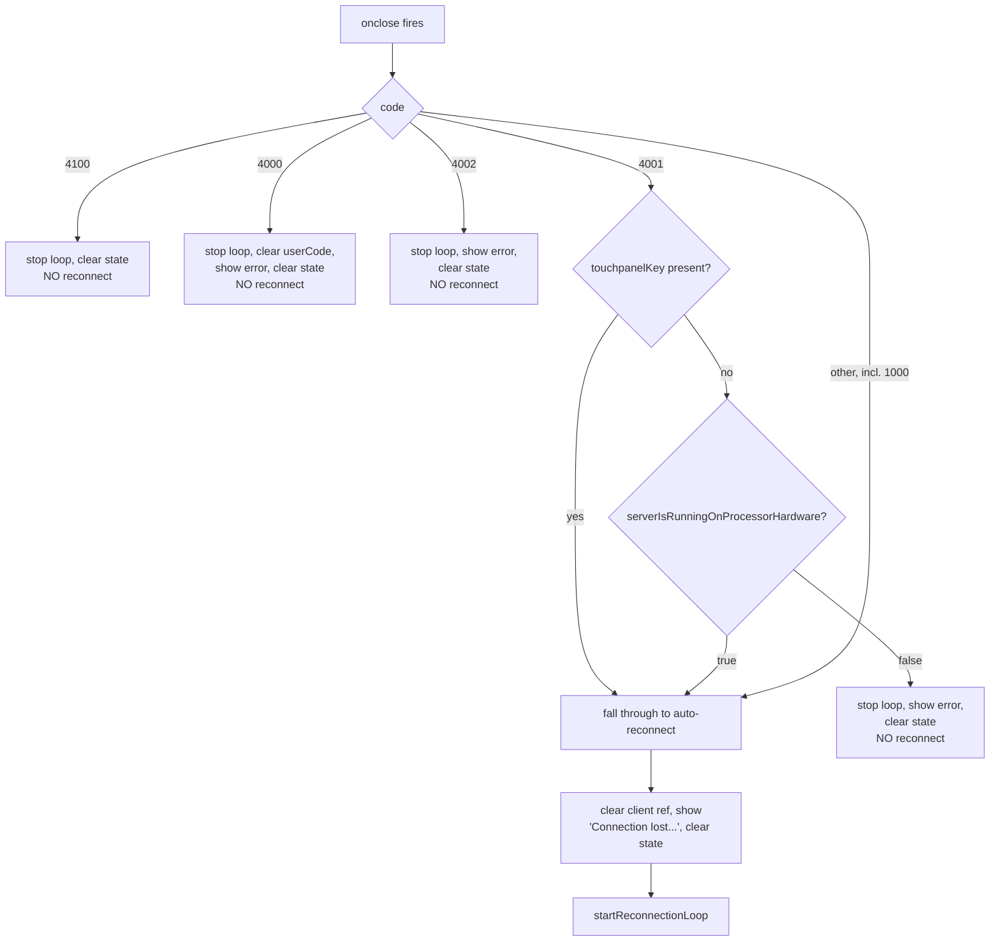

# WebSocket Middleware — Contributor Reference

**Relates to:** [Issue #93](https://github.com/PepperDash/mobile-control-react-app-core/issues/93) · [Document Mobile Control data flow #89](https://github.com/PepperDash/mobile-control-react-app-core/issues/89)

> [!IMPORTANT]
> **Needs Verification** — `requestRoomStatus` (below) guards on the *parameter* `roomKey`, not the resolved `currentRoomKey`. The two call sites that invoke it with no `roomKey` argument (on `setWebsocketIsConnected` and on `setRoomData`) will always hit `!roomKey` and return early, so in practice only the `setCurrentRoomKey` listener — which does pass a `roomKey` — ever sends a status request. If the intent is "always request status once connected and room data is known," the guard likely needs to check `currentRoomKey` instead of `roomKey`. Confirm against actual runtime logs before changing behavior. See [Reactive Listeners](#reactive-listeners) below.

Internal architecture of `createWebSocketMiddleware`: the only custom Redux middleware in the store, and the sole owner of the raw `WebSocket` connection to [PepperDash Essentials](https://github.com/PepperDash/Essentials).

**Key source:** `src/lib/store/middleware/websocketMiddleware.ts`

**Consumers:**
- `src/lib/store/store.ts` — registers the middleware via `.concat(createWebSocketMiddleware())`
- `src/lib/utils/WebsocketProvider.tsx` — thin component wrapper that dispatches the middleware's action creators and renders `DisconnectedMessage` while `isConnected` is false
- `src/lib/utils/useWebsocketContext.ts` / `WebsocketContext.ts` — the public hook/context apps consume (see the [App Developer Guide](./websocket-middleware-app-dev.md))

---

## Why Middleware, Not a Context/Effect?

The WebSocket client, its reconnection timer, and the event handler registry all need to survive component unmount/remount and be reachable from anywhere that dispatches an action — not just the component tree under one Provider. Modeling the connection as Redux middleware state (a closure variable captured once per `createWebSocketMiddleware()` call, not React state) gives:

- One connection per store, regardless of how many components mount/unmount.
- Redux DevTools visibility into every WebSocket-triggered action.
- A single place (`store.ts`) wiring the middleware in, rather than requiring a Context Provider to sit above every consumer.

---

## Action Creators

| Action | Type | Payload | Purpose |
| --- | --- | --- | --- |
| `wsConnect()` | `websocket/connect` | — | Load/save the join token, initialize config, open the socket |
| `wsDisconnect()` | `websocket/disconnect` | — | Client-initiated clean close (code `4100`) |
| `wsSendMessage(type, content)` | `websocket/sendMessage` | `{ messageType, content }` | Send a message if connected |
| `wsAddEventHandler(eventType, key, callback)` | `websocket/addEventHandler` | `{ eventType, key, callback }` | Register a handler for `/event/*` messages |
| `wsRemoveEventHandler(eventType, key)` | `websocket/removeEventHandler` | `{ eventType, key }` | Unregister a handler |
| `wsReconnect()` | `websocket/reconnect` | — | Navigate to the gateway app URL to restart the join flow |

`wsAddEventHandler`'s payload carries a function reference, which is why `store.ts` relaxes `serializableCheck.ignoredActions` for that action type (see [Redux State — Contributor Reference](./redux-state-contributors.md#store-composition)).

`wsReconnect` is **not** a socket-level reconnect — it sets `window.location.href` to the Mobile Control gateway app path (`gatewayAppPath?uuid=...&roomKey=...`), which is a full page navigation. The automatic retry path (below) never dispatches `wsReconnect`; it re-dispatches `wsConnect` from a timer instead.

---

## Middleware State

A single closure object, created once per `createWebSocketMiddleware()` call and mutated directly (not through `dispatch`) as the connection's lifecycle progresses:

```typescript
interface WebSocketMiddlewareState {
  client: WebSocket | null;
  token: string | null;
  waitingToReconnect: boolean;
  reconnectTimer: NodeJS.Timeout | null;
  eventHandlers: Record<string, Record<string, (data: Message) => void>>;
}
```

`eventHandlers` is keyed by event type, then by the caller-supplied `key`, so multiple components can register independent handlers for the same `/event/*` type without clobbering each other.

`waitingToReconnect` doubles as a connection lock: `connect()` bails out immediately if `state.client || state.waitingToReconnect` is true, which prevents two overlapping connection attempts (e.g. a rapid unmount/remount) from racing.

> [!NOTE]
> Inside the default branch of the reducer switch, a *local* `const state = store.getState() as LocalRootState` shadows the outer closure's `state` (the object above) for the rest of that block. It's scoped correctly and not a bug, but it reads as if the connection state were being reassigned — don't confuse the two `state`s when tracing this code.

---

## Connecting: `WS_CONNECT`



Steps, in `connect()`:

1. **Token resolution** (in the reducer, before `connect()` runs) — `?token=` query param wins and is saved to `sessionStorage`; otherwise the last saved token is loaded. This lets a bookmarked/reloaded URL without a token still rejoin the last room.
2. **`initialize()`** — computes a `baseURL` from `location.pathname` (see [URL Routing — Contributor Reference](./url-routing-contributors.md) for why the path is truncated to specific segment counts), fetches `_config.local.json`, dispatches `setAppConfig`, then fetches `{apiPath}/version` and dispatches `setRuntimeConfig` — this is where `serverIsRunningOnProcessorHardware` is populated.
3. **Guard** — if `apiPath` or the token is missing, or a client/connection attempt already exists, `connect()` returns without side effects.
4. **`getRoomData()`** — calls `{apiPath}/ui/joinroom?token=...`. A `498` response means an invalid/expired token and surfaces a user-facing error via `uiActions.setErrorMessage`; any other failure also surfaces an error and triggers `startReconnectionLoop`.
5. **Socket creation** — the `http(s)` `apiPath` is rewritten to `ws(s)` and the socket opens against `/ui/join/{token}?clientId={clientId}`.
6. **`onopen`** — connected state is not set immediately. See [Anti-Flash Delay](#anti-flash-delay).

---

## Disconnecting and Reconnecting: Close Code Handling

`onclose` branches on the WebSocket close code. This is the load-bearing logic for how the app recovers from lost connections:

| Close Code | Meaning | Auto-reconnect? |
| --- | --- | --- |
| `4100` | Client called `wsDisconnect()` (deliberate, clean shutdown) | No — state cleared, loop stopped |
| `4000` | User's join code changed server-side | No — `userCode` cleared, error shown, user must re-enter a code |
| `4002` | Room combination changed | No — error shown, user must manually reconnect |
| `4001`, touchpanel key present | Touchpanel-driven session lost connection | **Yes** |
| `4001`, no touchpanel key, `serverIsRunningOnProcessorHardware === false` | Server likely stopped intentionally (e.g. a dev machine) | No — "Processor has disconnected" shown |
| `4001`, no touchpanel key, `serverIsRunningOnProcessorHardware === true` | Transient loss on processor hardware | **Yes** |
| Everything else (including `1000` normal closure, network errors) | Unexpected disconnect | **Yes** |

A present `touchpanelKey` takes priority over the hardware flag for `4001` — an active touchpanel session is treated as worth retrying regardless of what kind of server it's talking to.



### Reconnection Loop

```typescript
const startReconnectionLoop = (dispatch: Dispatch) => {
  if (state.reconnectTimer) {
    clearTimeout(state.reconnectTimer);
    state.reconnectTimer = null;
  }
  state.reconnectTimer = setTimeout(() => {
    state.waitingToReconnect = false;
    state.reconnectTimer = null;
    dispatch(wsConnect());
  }, 5000);
};
```

A fixed 5-second `setTimeout` re-dispatches `wsConnect()`. There is no backoff and no attempt limit — it retries indefinitely until a connection succeeds or a terminal close code / explicit `wsDisconnect()` calls `stopReconnectionLoop()`. `startReconnectionLoop` always clears any existing timer first, so overlapping disconnect events don't stack multiple timers.

### Anti-Flash Delay

```typescript
newWs.onopen = (ev: Event) => {
  state.waitingToReconnect = false;
  stopReconnectionLoop();
  setTimeout(() => {
    if (state.client === newWs && newWs.readyState === WebSocket.OPEN) {
      dispatch(runtimeConfigActions.setWebsocketIsConnected(true));
    }
  }, 100);
};
```

`onopen` can fire for a connection that closes again almost immediately. Setting `isConnected` synchronously in `onopen` would flash the app's children on then back off to `DisconnectedMessage`. Delaying by 100ms and re-checking that `newWs` is still the current client and still `OPEN` avoids that flash, at the cost of a small connect-latency delay.

### `clearStateDataOnDisconnect`

Every non-reconnecting close path (and the auto-reconnect path) clears the same set of state: `setShowReconnect(true)`, `setWebsocketIsConnected(false)`, `clearDevices()`, `clearRooms()`, `clearAllModals()`, `clearSyncState()`. Room/device state is not preserved across a disconnect — on reconnect, state repopulates from fresh `/room/*` and `/device/*` messages (see [Device State & Feedback — Contributor Reference](./device-state-feedback-contributors.md)).

---

## Message Routing: `onmessage`

Incoming frames are parsed as `Message` (`{ type, clientId?, content }`) and routed by `type` prefix:

| Prefix / value | Handling |
| --- | --- |
| `close` | Closes the socket with code `4001`, `content` as the close reason |
| `/system/touchpanelKey` | `runtimeConfigActions.setTouchpanelKey` |
| `/system/roomKey` | Clears rooms/devices/sync state, then `setCurrentRoomKey` |
| `/system/userCodeChanged` | `runtimeConfigActions.setUserCode` |
| `/system/roomCombinationChanged` | Full page reload (`window.location.reload()`) |
| `/system/deviceInterfaces` | `runtimeConfigActions.setDeviceInterfaces` |
| other `/system/*` | Logged, unhandled |
| `/event/*` | Looked up in `state.eventHandlers[type]` and every registered handler invoked; a handler that throws is caught and logged individually so one bad handler can't break the others |
| `/room/*` | `roomsActions.setRoomState(message)` |
| `/device/*` | `devicesActions.setDeviceState(message)` |

Dev-mode-only (`import.meta.env.DEV`) `console.log` calls print every message and every event message — expect console noise in development builds by design, not by mistake.

---

## Reactive Listeners

The default branch of the outer reducer switch also inspects *other* slices' action types (not just the `WS_*` ones) to trigger `requestRoomStatus`:

```typescript
const requestRoomStatus = (
  getState: () => LocalRootState,
  roomKey?: string
) => {
  const rootState = getState();
  const currentRoomKey = roomKey ?? rootState.runtimeConfig.roomData.roomKey;
  const { clientId } = rootState.runtimeConfig.roomData;
  const isConnected = rootState.runtimeConfig.websocket.isConnected;

  if (!roomKey || !isConnected || !clientId) {
    return;
  }
  // ... sends `/room/{currentRoomKey}/status`
};
```

Three actions from other slices trigger a call, each after a 100ms `setTimeout`:

- `runtimeConfigActions.setWebsocketIsConnected` (payload `true`) — called with **no** `roomKey` argument.
- `runtimeConfigActions.setRoomData` (when `isConnected && roomData?.clientId`) — called with **no** `roomKey` argument.
- `runtimeConfigActions.setCurrentRoomKey` — called **with** the new `roomKey`.

See the callout at the top of this document — the `!roomKey` guard checks the parameter, so only the third listener's call actually passes it and sends a message.

---

## Sending Messages

```typescript
const sendMessage = (messageType, content, getState) => {
  const { isConnected } = getState().runtimeConfig.websocket;
  const { clientId } = getState().runtimeConfig.roomData;
  if (state.client && isConnected) {
    state.client.send(JSON.stringify({ type: messageType, clientId, content }));
  } else {
    console.warn('WebSocket middleware: Cannot send message - not connected');
  }
};
```

No outbound queue — a message sent while disconnected is dropped with a console warning, not buffered for later delivery.

---

## Adding New Middleware Behavior

- **New outbound action**: add a `WS_*` constant, an action creator, and a `case` in the reducer switch that calls a new private function following the existing pattern (`connect`, `disconnect`, `sendMessage`, ...).
- **New inbound message type**: add a branch to the `type` prefix `if`/`switch` chain in `onmessage`. Prefer dispatching into an existing slice over adding new middleware-local state.
- **New reactive listener** (react to another slice's action rather than a `WS_*` action): add a branch in the `default` case, following the `setWebsocketIsConnected` / `setRoomData` / `setCurrentRoomKey` pattern — but see the open guard-logic question above before copying `requestRoomStatus`'s pattern verbatim.

For the app-facing surface built on top of this middleware, see [WebSocket Middleware — App Developer Guide](./websocket-middleware-app-dev.md).
